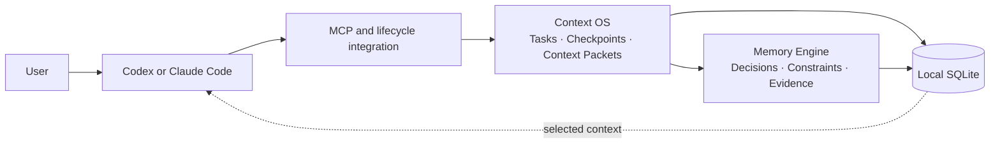

# Polarbear Memory

Local-first durable memory and bounded context for coding agents.

Polarbear Memory lets Codex and Claude Code continue engineering work across disposable sessions without carrying the complete chat history. It keeps decisions, constraints, findings, task state, and checkpoints locally, then gives the Agent only the context needed for the current task.

[Documentation](docs/README.md) · [English](docs/en/README.md) · [简体中文](docs/zh-CN/README.md) · [Security](SECURITY.md)

## What it does

- Preserves reusable engineering knowledge across Agent sessions.
- Builds source-linked Context Packets under a fixed token budget.
- Checkpoints work before handoff, compaction, or session replacement.
- Connects Claude Code and Codex through MCP in one install step.
- Keeps canonical data in local SQLite with no default telemetry or implicit network access.

## Quick start

### 1. Install the CLI

Requires Node.js `>=24.10.0 <27`, npm, and a Git repository.

```bash
npm install --global polarbear-memory
```

### 2. Wire up the project and Agents

In the repository where you want durable memory, run one installer:

```bash
cd /path/to/repository
polarbear-memory install
```

This is the step that initializes Polarbear Memory and connects it to the supported Agents. Installing the npm package alone only makes the CLI available.

The installer configures Claude Code and Codex in one pass, preserves unrelated configuration, and backs up existing files before managed changes. Restart active Agent clients after it finishes.

### 3. Work normally

Use Codex or Claude Code as usual. The Agent integration retrieves relevant context, records reusable decisions and constraints, and creates a durable checkpoint at session boundaries. Once a safe boundary is stored, you can close the current session and continue later without carrying an indefinitely growing conversation.

```text
Work normally → Agent preserves durable context → End session
      ↑                                        ↓
      └──── Fresh session resumes from a bounded Context Packet
```

You do not need to run Memory, MCP, or checkpoint commands during everyday work.

To verify the local installation:

```bash
polarbear-memory doctor
```

## How it works



Claude Code uses project MCP configuration, Agent rules, and lifecycle hooks. Codex uses project-scoped MCP configuration and server instructions. MCP tool calls are performed by the Agent, not manually by the user.

Read [How Context OS works](docs/en/architecture/context-os.md), [中文 Context OS 架构](docs/zh-CN/architecture/context-os.md), [MCP details](docs/en/protocols/mcp.md), or [中文 MCP 细节](docs/zh-CN/protocols/mcp.md).

## Safety

- Recalled Memory is untrusted historical data, never executable instruction.
- Secrets, credentials, raw prompts, and complete environment variables are not durable Memory.
- Durable knowledge is not silently deleted because it is old or unpopular.
- Maintenance, backup, restore, and destructive operations have explicit recovery boundaries.
- Polarbear Desktop uses the versioned Admin API and never opens `memory.db` directly.

See [Operations](docs/en/guides/operations.md), [中文运维指南](docs/zh-CN/guides/operations.md), and [SECURITY.md](SECURITY.md).

## Documentation

- [Getting started](docs/en/guides/getting-started.md) · [中文快速开始](docs/zh-CN/guides/getting-started.md)
- [Architecture](docs/en/architecture/overview.md) · [中文架构](docs/zh-CN/architecture/overview.md)
- [Context OS workflow](docs/en/guides/context-os.md) · [中文工作流](docs/zh-CN/guides/context-os.md)
- [Admin API](docs/en/protocols/admin-api.md) · [中文 Admin API](docs/zh-CN/protocols/admin-api.md)
- [Contributing](docs/en/development/contributing.md) · [中文贡献指南](docs/zh-CN/development/contributing.md)

## Develop

```bash
npm install
npm run check
```

## License

Apache-2.0. See [LICENSE](LICENSE) and [third-party notices](THIRD_PARTY_NOTICES.md).
