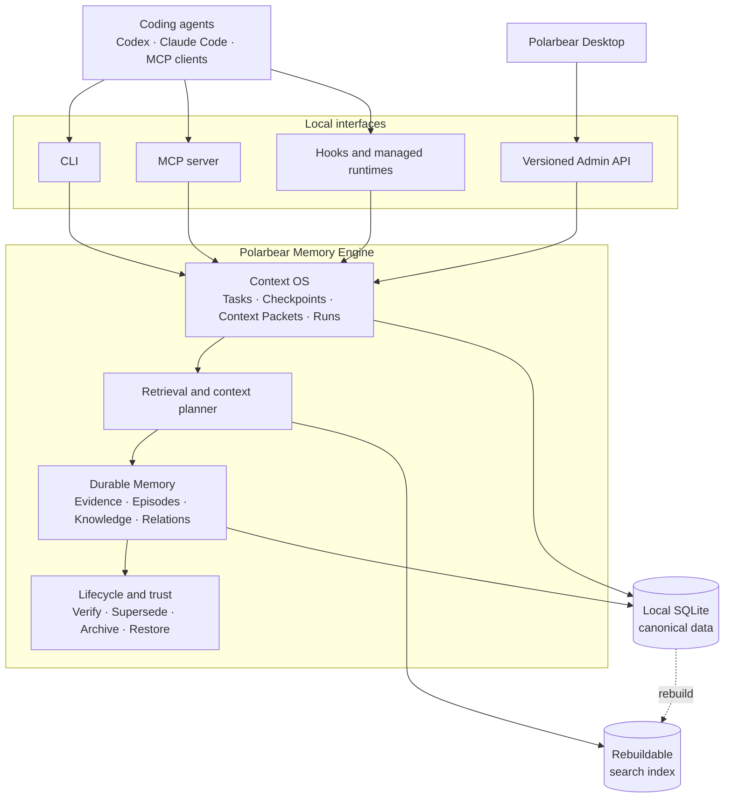
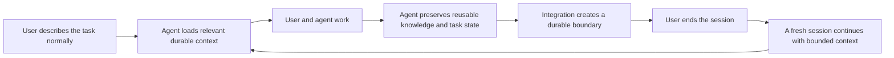

# Polarbear Memory

**Local-first durable memory and context management for coding agents.**

Polarbear Memory helps Codex, Claude Code, and other MCP-compatible agents continue engineering work across disposable sessions. It stores decisions, constraints, evidence, failures, task state, and checkpoints locally, then assembles a small, source-linked Context Packet for the work at hand.

[Documentation](docs/README.md) · [English](docs/en/README.md) · [简体中文](docs/zh-CN/README.md) · [Security](SECURITY.md)

## Why Polarbear Memory?

Long-running engineering work rarely fits in one agent session. Conversation history grows, compaction loses detail, and a new session must rediscover the repository. Polarbear Memory moves durable project context out of the conversation and into a local, inspectable system.

It provides:

- **Durable engineering memory** for decisions, constraints, patterns, pitfalls, evidence, and task handoffs.
- **Bounded context assembly** that retrieves only relevant information within an explicit token budget.
- **Cross-session task continuity** through durable Tasks, Checkpoints, Context Packets, and execution history.
- **Explainable retrieval** with source links, selection reasons, lifecycle state, and revision history.
- **Safe memory lifecycle** with verification, supersession, archive, restore, backup, and reversible maintenance.
- **Agent integrations** through CLI, MCP, Claude Code hooks, and managed Codex or Claude Code runs.
- **A versioned local Admin API** for desktop and operational tooling without direct database access.
- **Local-first operation** with no default telemetry or implicit network access.

## Architecture



SQLite is the canonical local store. Search indexes are derived and rebuildable. Polarbear Desktop communicates through the versioned Admin API and never reads or writes `memory.db` directly.

Read the [architecture overview](docs/en/architecture/overview.md) or [中文架构概览](docs/zh-CN/architecture/overview.md) for component boundaries and data flow.

## Install

Requirements: Node.js `>=24.10.0 <27`, npm, and a Git repository.

```bash
npm install --global polarbear-memory
polarbear-memory --version
```

Initialize Polarbear Memory inside a repository:

```bash
cd /path/to/repository
polarbear-memory init --dry-run
polarbear-memory init
```

Initialization adds repository-local configuration under `.polarbear/`. Memory data stays in the current user's Polarbear data directory and is not committed to Git.

### Connect Claude Code

This one-time step is required for automatic Claude Code integration. It installs the project MCP configuration, Agent rules, and lifecycle hooks. Without it, the Memory Engine is installed but Claude Code is not connected to it.

Preview the changes, then install them:

```bash
polarbear-memory claude install --dry-run
polarbear-memory claude install
```

Restart Claude Code after installation. Existing supported configuration is merged and backed up before managed files are changed.

### Connect Codex or another MCP client

Add the Polarbear Memory stdio server to the client's MCP configuration once. The exact configuration and Agent-facing tools are documented in the [MCP setup guide](docs/en/protocols/mcp.md) and [中文 MCP 配置说明](docs/zh-CN/protocols/mcp.md).

For source installation and complete setup details, see [Getting started](docs/en/guides/getting-started.md) or [中文快速开始](docs/zh-CN/guides/getting-started.md).

## Use

After installation and Agent integration, use Codex or Claude Code normally. You do not need to run Polarbear commands during everyday work.



The fresh session receives selected task state and Memory instead of the complete previous conversation. You can close a session once the integration has persisted a safe boundary, then continue in a fresh session without carrying an indefinitely growing chat history. This reduces carried context and can reduce input-token usage; actual provider billing depends on the provider and model.

Claude Code uses installed lifecycle hooks for session boundaries. Codex and other MCP clients use Agent-facing MCP tools. These are integration details rather than actions the user should perform during normal work.

To understand how retrieval, Memory recording, checkpoints, MCP tools, and session rotation work, read the [Context OS workflow](docs/en/guides/context-os.md), [中文 Context OS 工作流](docs/zh-CN/guides/context-os.md), [MCP details](docs/en/protocols/mcp.md), or [中文 MCP 细节](docs/zh-CN/protocols/mcp.md).

The CLI and Polarbear Desktop remain available for diagnostics, recovery, inspection, and explicit administration.

## Safety model

- Recalled Memory is treated as untrusted project data, never as hidden instructions.
- Secrets, credentials, raw prompts, and complete environment variables are not durable Memory.
- Durable knowledge is not silently deleted merely because it is old or unpopular.
- Destructive operations have explicit preview, validation, audit, and recovery boundaries.
- Storage and agent integrations are local by default.

Read [operations and recovery](docs/en/guides/operations.md), the [中文运维指南](docs/zh-CN/guides/operations.md), and the [security policy](SECURITY.md).

## Documentation

| I want to... | English | 简体中文 |
| --- | --- | --- |
| Understand the system | [Architecture](docs/en/architecture/overview.md) | [架构设计](docs/zh-CN/architecture/overview.md) |
| Understand durable memory | [Memory Engine](docs/en/architecture/memory-engine.md) | [Memory Engine](docs/zh-CN/architecture/memory-engine.md) |
| Understand cross-session context | [Context OS](docs/en/architecture/context-os.md) | [Context OS](docs/zh-CN/architecture/context-os.md) |
| Integrate through MCP | [MCP](docs/en/protocols/mcp.md) | [MCP](docs/zh-CN/protocols/mcp.md) |
| Integrate desktop or admin tooling | [Admin API](docs/en/protocols/admin-api.md) | [Admin API](docs/zh-CN/protocols/admin-api.md) |
| Operate or recover the service | [Operations](docs/en/guides/operations.md) | [运维与恢复](docs/zh-CN/guides/operations.md) |
| Contribute code | [Contributing](docs/en/development/contributing.md) | [参与贡献](docs/zh-CN/development/contributing.md) |

The [documentation map](docs/README.md) explains ownership and translation rules.

## Develop

```bash
npm install
npm run check
```

Before contributing, read the [contribution guide](docs/en/development/contributing.md) and [engineering guidelines](AGENTS.md).

## License

Apache-2.0. See [LICENSE](LICENSE) and [third-party notices](THIRD_PARTY_NOTICES.md).
