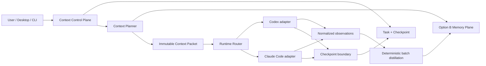
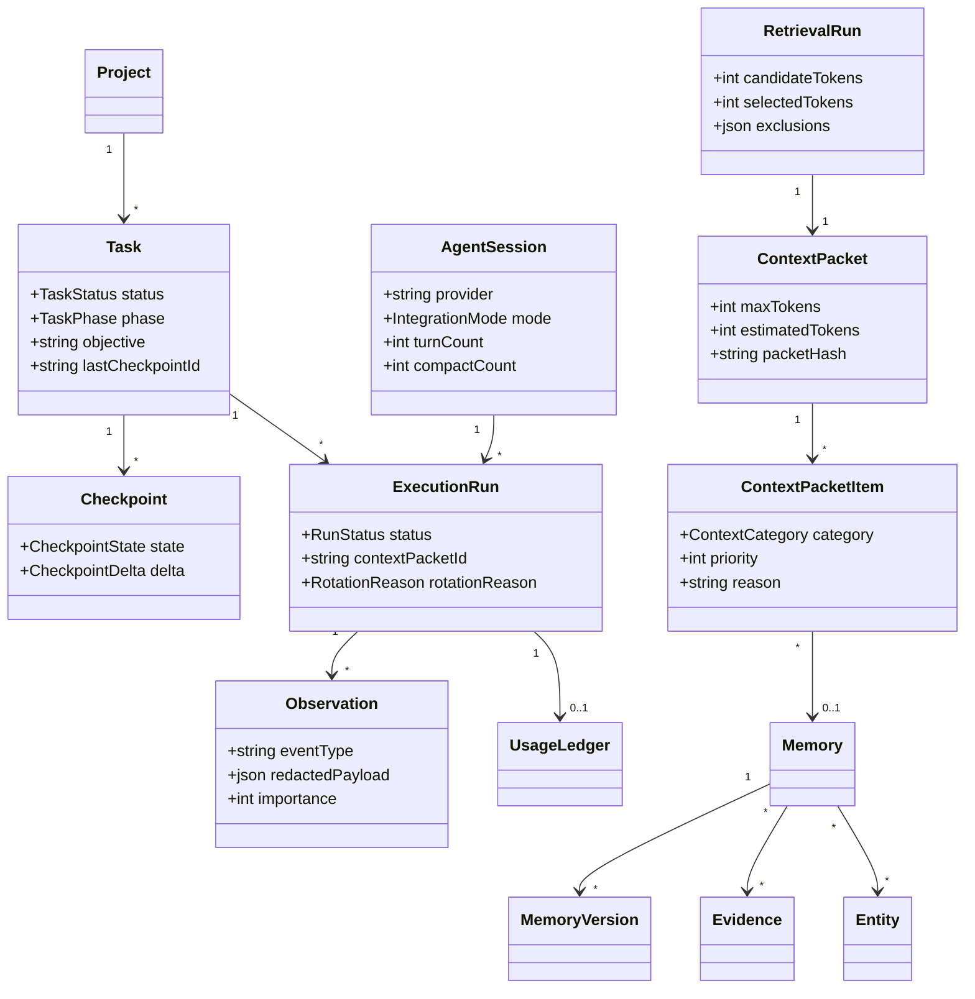
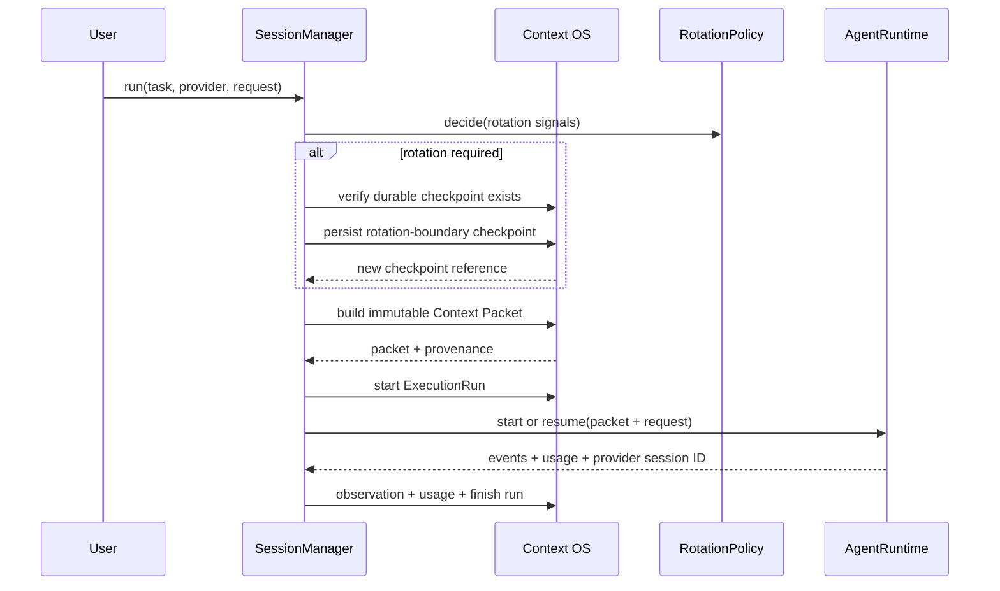

# Polarbear Agent Context OS Design

Status: implemented architecture addendum  
Baseline: approved Option B Fact + Episode + Entity storage model  
Schema: v8  
Admin API: 1.3

## 1. Architectural decision

Polarbear owns durable project and task state. Codex and Claude Code sessions are bounded, replaceable execution environments.

The upgrade does not replace the existing Option B knowledge model. It adds a task/context control plane around the existing `knowledge_units`, versions, evidence, entities, relations, episodes, FTS index, lifecycle assessment, and retention machinery.

## 2. Implementation delta

| Existing capability | Context OS capability | Implementation |
|---|---|---|
| Memory, Version, Evidence, Entity, Relation | Preserved durable knowledge plane | Existing domain and storage modules remain authoritative |
| `TASK_STATE` and `TODO` memories | First-class Task lifecycle | `domain/context-os.ts`, `task-checkpoint-repository.ts` |
| Free-form handoff summaries | Structured snapshot + delta checkpoints | `checkpoints` table and `task_checkpoint` operation |
| One-shot `compileContext` | Immutable, category-budgeted Context Packet | `context-planner.ts`, `context-packet-repository.ts` |
| Search rank only | Task, checkpoint, type, verification, importance, lexical/entity/graph/temporal retrieval | Existing hybrid query service plus deterministic fusion |
| Claude Stop/SessionEnd capture | Full assisted lifecycle observation | SessionStart, prompt, tool, compact, stop, and end hooks |
| Provider-specific shell integration | Provider-neutral managed runtime | `runtime/agent-runtime.ts`, router, session manager |
| Aggregate token savings | Per-run usage and retrieval ledger | `usage_ledger`, `retrieval_runs`, Context OS metrics |
| Admin API 1.2 | Desktop Task/Packet/Checkpoint management | Admin API 1.3 and generated Desktop contract |

## 3. Domain model

Task status is one of `PLANNED`, `ACTIVE`, `BLOCKED`, `VERIFYING`, `DONE`, or `CANCELLED`. Task phase is one of `DISCOVERY`, `DESIGN`, `IMPLEMENTATION`, `DEBUGGING`, `VERIFICATION`, `REVIEW`, or `DOCUMENTATION`.

## 4. Context planning

The planner retrieves at most 100 candidates from the existing hybrid query service and injects first-class Task and latest Checkpoint candidates. It maps candidates to categories:

| Priority | Categories |
|---|---|
| P0 | objective, working state, constraints, decisions, disputed/high-risk warnings |
| P1 | architecture and conventions |
| P2 | incidents, pitfalls, workarounds, verification |
| P3 | general semantic knowledge |

Every packet records:

- the request/query digest and provider; the complete current request exists only in the transient packet returned to the caller;
- the total token budget;
- category limits and usage;
- selected sources, stable rank, score, reason, and truncation state;
- every budget exclusion;
- the rendered text and its hash;
- retrieval latency and candidate/selected token estimates.

The rendered packet is pruned until its estimated size is within the hard budget. Before optional candidates are considered, the planner reserves a bounded mandatory slot for the first available objective, working-state, constraint, decision, and high-risk verification candidate. Large items are truncated and retain their Memory IDs for progressive disclosure through `memory_get`. Database growth therefore does not linearly increase injected context.

Context content is always labeled untrusted historical data. It is data for reasoning, never instructions to execute.

## 5. Runtime architecture

`AgentRuntime` exposes explicit capabilities for persisted sessions, resume, event streaming, usage, MCP, hooks, and compaction signals. `RuntimeRouter` is the only provider selection point.

The Codex adapter uses the officially documented non-interactive JSONL flow and session resume. The Claude Code adapter uses print mode, stream JSON, and session resume. Runtime availability is detected before execution. CLI output is bounded, parsed as data, and never evaluated by a shell. A user-selected model is passed to the provider and recorded as the run model; CLI version detection is capability metadata, not model identity.

Managed execution is disabled by default. It requires `POLARBEAR_MANAGED_SESSIONS=1`. Read-only runtime permissions are the default: Codex receives the `read-only` sandbox and Claude Code receives `--permission-mode plan`. Callers must explicitly request workspace writes, which selects the Codex `workspace-write` sandbox or Claude Code `acceptEdits` mode. A requested rotation is rejected if the Task has no durable checkpoint; when one exists, Polarbear persists a new rotation-boundary snapshot before starting the fresh provider session.

References:

- [OpenAI Codex SDK](https://learn.chatgpt.com/docs/codex-sdk)
- [OpenAI Codex non-interactive mode](https://learn.chatgpt.com/docs/non-interactive-mode)
- [Claude Code CLI reference](https://code.claude.com/docs/en/cli-usage)
- [Claude Code hooks reference](https://code.claude.com/docs/en/hooks)

## 6. Observe and distill

Claude assisted mode installs defensive hooks for SessionStart, UserPromptSubmit, PreToolUse, PostToolUse, PreCompact, PostCompact, Stop, and SessionEnd. Payloads are bounded, redacted, hashed, and stored locally. Session IDs are represented by hashes in durable storage.

SessionStart can return a compact Context Packet when `POLARBEAR_TASK_ID` identifies an existing Task. PreCompact creates a durable compaction-boundary checkpoint. SessionEnd runs bounded deterministic batch distillation.

The initial distiller extracts only explicitly labeled decisions, pitfalls, task state, and next steps. It does not call an LLM per event and does not infer a high-confidence fact from arbitrary tool output. Observation fingerprints and knowledge content hashes make replay idempotent.

## 7. Storage and migration

Schema v8 is additive. It introduces:

- `tasks`;
- `agent_sessions`;
- `execution_runs`;
- `observations`;
- `checkpoints`;
- `retrieval_runs`;
- `context_packets`;
- `context_packet_items`;
- `usage_ledger`.

Existing schema v7 data is not fabricated into Tasks or Checkpoints. The migration creates a preflight backup for a file database, applies additive DDL and refreshes the compatibility view in one `BEGIN IMMEDIATE` transaction, rejects foreign-key violations, records checksum `v8-agent-context-os-2026-08-29`, and restores the backup if migration fails.

The old Memory APIs, MCP tools, CLI commands, and persisted knowledge remain valid. `memory_context` stays available; `context_get` is the first-class Context OS operation.

## 8. Security and trust

- The Engine remains local-first and does not perform remote rendering or remote context assembly.
- Desktop uses the user-scoped local Admin API and never opens `memory.db`.
- Provider processes are started with argument arrays and `shell: false`.
- Runtime output and hook input are bounded.
- Managed mode is feature-gated and read-only by default.
- Provider session identifiers are hashed before durable mapping.
- Context Packet content carries a prompt-injection trust boundary.
- Hook payloads use existing redaction before persistence.
- Raw user prompts are not persisted: Context Packet and hook records retain bounded SHA-256 identifiers instead.
- Rotation never discards a session automatically when checkpoint persistence is absent.

Mermaid diagrams in this document are rendered locally by supported clients. No PlantUML remote rendering endpoint is required.

## 9. Dependencies and licenses

No new runtime npm dependency is introduced. Managed adapters invoke user-installed official CLIs. This avoids embedding either provider SDK and avoids adding transitive package/license exposure to the published Engine.

Existing shipped dependencies remain covered by `THIRD_PARTY_NOTICES.md`, SBOM generation, license checks, advisory checks, and the npm publication allowlist. The project remains Apache-2.0.

Provider CLIs are separate user-installed programs governed by their own terms; they are not redistributed in the npm package.

## 10. Delivery roadmap

| Phase | Deliverable | Status |
|---|---|---|
| P0 | Task, ExecutionRun, Checkpoint, Context Packet, schema v8 | Implemented |
| P1 | Budgeted planner, provenance, `context_get`, explain | Implemented |
| P2 | Claude MCP/hooks assisted lifecycle | Implemented |
| P3 | Codex MCP assisted handoff | Implemented |
| P4 | Provider-neutral managed runtimes and rotation policy | Implemented behind disabled-by-default flag |
| P5 | Observation aggregation and deterministic distillation | Implemented baseline; semantic LLM distillation remains optional future work |
| P6 | Usage ledger, context metrics, deterministic A/B/C evaluation harness | Implemented baseline |
| P7 | Parallel multi-agent routing and conflict reconciliation | Deferred |

P7 is deliberately outside the current release. It should begin only after packet quality, rotation safety, and Context OS metrics have been validated with real projects.

## 11. Definition of done and limits

The implemented vertical slice can persist a Task without an agent session, checkpoint it, build and explain a bounded immutable packet, hand it to either managed runtime, observe usage, and continue the same durable task with another provider.

The current implementation does not claim autonomous semantic understanding of every tool event. It favors explicit capture and deterministic distillation. It also does not force users of official Codex or Claude UIs into managed mode; assisted mode cannot guarantee that provider history has been removed.

The deterministic evaluation fixture at `fixtures/context-os-ab-c/fixture.json` covers continuation, failed debugging, implementation-to-review, both provider-switch directions, returning after unrelated work, decision continuity, and hard budget pressure. The existing `benchmark` command reports three logical modes: provider history (A), Memory added to provider history (B), and bounded Context OS reconstruction (C). Automated integration tests additionally cover both provider-switch directions, resume failure recovery, checkpoint-before-rotation, Claude SessionStart/PreCompact lifecycle behavior, and the JSONL contracts and permission arguments of both CLI adapters.

These tests validate the Engine-owned handoff path and logical context size without requiring provider accounts. Provider billing claims and compatibility with a newly released provider CLI still require captured usage and release-time smoke runs against the installed official CLIs.
