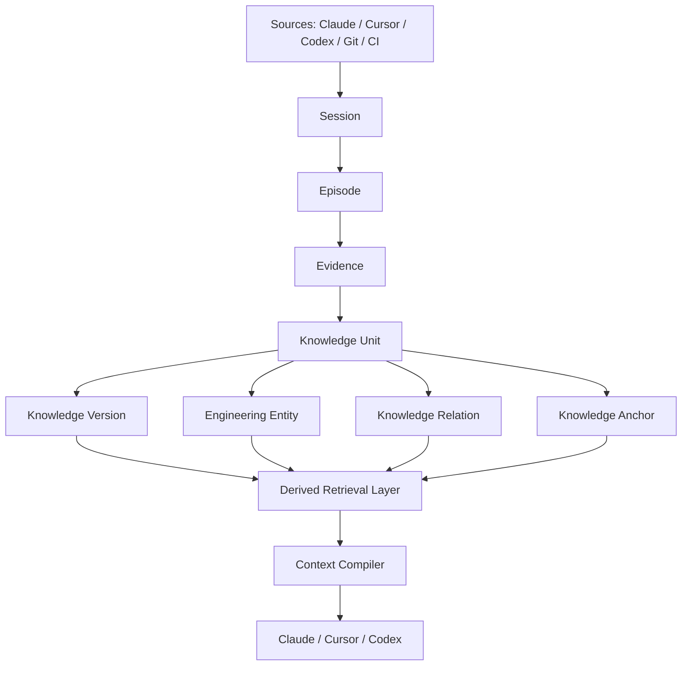

# Polarbear Memory 技术需求文档（TRD）

> **对应 PRD**：[Polarbear Memory PRD](./PRD.md)
> **版本**：v2.0
> **文档日期**：2026-08-28
> **状态**：V2 实现基线；schema v7
> **目标版本**：Polarbear Memory V2

---

## 1. 文档目标

本 TRD 把 PRD 中的产品目标转化为可实现、可运行、可测试和可演进的技术方案。重点回答：

1. Polarbear Memory 的宏观技术愿景和长期边界是什么？
2. v0.1 如何用最小依赖完成完整的 session resume 闭环？
3. 每个 MVP 如何保持可独立运行、可测量，并能快速证伪假设？
4. 从单进程 CLI 到跨 Agent、本地服务和 Polarbear Viewer 的技术路线如何演进？
5. 如何从架构上阻止隐式网络请求、secret 泄漏、memory poisoning 和权限越界？
6. 如何选择外部组件并持续控制开源许可证和供应链风险？

本文件是技术方向和验收门槛，不代替后续 ADR、schema migration、API schema 和 threat-model 测试用例。

## 2. 宏观愿景

### 2.1 长期形态

Polarbear Memory 最终是一个本地 AI Engineering Knowledge Runtime：

- 向上通过 MCP、Hooks、Skills 和 SDK 服务 Claude Code、Codex、Cursor、Polarbear Desktop 及其他客户端。
- 向下组合 Memory、Git、Filesystem 和可选 CodeGraph 等 provider。
- 中间以 Memory Lifecycle、Retrieval 和 Context Compiler 形成产品壁垒。
- 默认离线、可审计、可导出、可删除，不依赖 Polarbear Desktop 或云账户。

V2 将内部模型从 Everything is Memory 升级为 **Fact + Episode + Entity Hybrid Knowledge Model**。产品与 MCP 继续使用 Memory 这个用户概念；数据库内部的长期知识正式称为 Knowledge Unit。



```text
┌────────────────────────────────────────────────────────────┐
│ Clients                                                    │
│ Claude Code · Codex · Cursor · CLI · Polarbear Desktop     │
└──────────────────────────┬─────────────────────────────────┘
                           │ MCP / Hooks / Local API
┌──────────────────────────▼─────────────────────────────────┐
│ Polarbear Memory Runtime                                   │
│ Application Services · Policy · Capability Boundary        │
├───────────────┬──────────────────┬─────────────────────────┤
│ Extraction    │ Lifecycle        │ Context Compiler        │
│ candidates    │ stale/verify     │ retrieve/rank/compress  │
├───────────────┴──────────────────┴─────────────────────────┤
│ Domain Model · Repositories · Events · Versioned Contracts │
├───────────────────┬────────────────┬───────────────────────┤
│ SQLite + FTS5     │ Git CLI        │ Optional Providers    │
│ operational truth │ current change │ CodeGraph, future     │
└───────────────────┴────────────────┴───────────────────────┘
```

### 2.2 不变的架构约束

以下约束从第一个 MVP 起就成立，后续版本不得以“临时实现”为理由破坏：

1. Core 不依赖 Polarbear Desktop、Claude Code 或任一特定 Agent。
2. Memory Engine 是 `memory.db` 的唯一所有者和读写者；Polarbear Desktop 通过完整的 Admin API / SDK 管理 Memory Engine，而不是直接执行 SQL。
3. SQLite 中的 Session、Episode、Evidence 与 Knowledge 是 canonical truth；FTS、Entity 检索投影和未来 Vector/Graph Projection 都是可删除、可重建索引。
4. Durable Markdown 是发布/审阅投影，不是数据库的隐式副本。
5. Runtime 默认不具备网络出口；网络能力必须是独立、显式、可审计的 provider。
6. Memory 内容永远是不可信数据，不能被当作命令或系统指令执行。
7. 所有重要输出都必须保留 source、evidence、lifecycle 和 schema version。
8. 每个版本都必须能从干净环境运行端到端闭环，不能只交付“下一版本才可用”的底层模块。

### 2.3 关键技术假设

- 开发项目中的文件名、symbol、错误码和领域词有较高关键词密度，FTS5 + metadata 足以验证 v0.1。
- session resume 的价值可在没有 embedding、云模型和 CodeGraph 的情况下证明。
- 当前 Agent 可以在 session end 按 JSON schema 产出候选摘要，v0.1 不需要额外 extractor 模型。
- 低并发阶段可依靠 SQLite WAL 支持多个短生命周期 Node 进程；只有 Viewer 和多个 Agent 并发证明有需要时才引入 daemon。
- 陈旧检测先以 commit、路径、内容 fingerprint 和 diff overlap 实现，不在 v0.1 引入多语言 AST 基础设施。
- Memory v0.1 的主要工作是 JSON/MCP 编排、SQLite 查询和确定性文本组装，没有已知的 CPU 密集内核；先用 TypeScript 验证产品，只有 profiling 和 benchmark 证明热点后才引入 Rust。

这些都是待 benchmark 验证的假设，不是既定事实。

## 3. 技术决策摘要

| 领域 | v0.1 决策 | 原因 | 后续演进条件 |
| --- | --- | --- | --- |
| 主语言 | TypeScript / Node.js control plane | 最快验证 CLI、MCP、Hooks、Admin API；与 Polarbear 前端技术栈一致 | profiling 达到门槛后增加可选 Rust kernel，不重写控制面 |
| 进程模型 | CLI / MCP stdio 进程直接调用 Core | 最少安装面，无 daemon 生命周期 | Viewer/多 Agent 并发出现后引入 local service |
| 数据库 | 固定 Node runtime 的 `node:sqlite` + FTS5 | 无额外 native npm addon，本地、事务、无服务依赖 | 启动时做 FTS5 capability self-test；Node API 不满足时再评估 binding |
| 检索 | FTS5 + Entity recall + metadata + 1-hop relation + temporal/lifecycle filter | 可解释、离线、无需 vector dependency | benchmark 证明 recall 不足后再增加 derived vector index |
| Git | 调用本机 `git`，仅固定只读子命令 | 避免 libgit2 依赖与许可证/原生构建面 | 性能不达标再评估 gitoxide/libgit2 |
| MCP | 官方 TypeScript SDK，stdio transport only | 与 JSON/Node 控制面自然衔接 | SDK 不稳定时由内部 protocol facade 隔离 |
| Agent 首发 | Claude Code | 单点验证自动 capture/resume | v0.2 增加 Codex、Cursor adapter |
| Token 计数 | 可插拔 estimator；MVP 用保守近似 | 避免首版绑定 model tokenizer | benchmark 证明预算误差后接入经审计 tokenizer |
| 分发 | 平台包捆绑固定 Node runtime + 编译后 JS | 用户无需预装 Node，运行环境与 SQLite 能力可复现 | 单文件 SEA 仅在签名、资源和 native 能力验证后评估 |
| 网络 | release 默认无 HTTP client dependency | 防隐式外联与数据泄漏 | 独立 provider process、显式授权、domain allowlist |
| UI | v0.1 后段接入 Polarbear Viewer | 先证明 Engine，再建设控制面 | local service + versioned API |
| Diagram | Runtime 不渲染 PlantUML/Mermaid | 与核心目标无关，避免远程渲染和内容解析风险 | Viewer 只显示源码或使用已审计离线 renderer |

## 4. 质量属性优先级

按发生冲突时的决策优先级排序：

1. **不泄漏数据、不执行不可信内容**。
2. **不把错误或陈旧记忆伪装成确定事实**。
3. **不阻断用户原有 Agent 工作流**。
4. **数据库可恢复且迁移可回滚**。
5. **Context Pack 在 token 预算内且可解释**。
6. **降低重复探索成本**。
7. **自动化程度与 UI 丰富度**。

因此，任何“更智能”的方案如果降低了可解释性、安全性或离线能力，默认不进入 v0.1。

## 5. 代码仓库与模块设计

### 5.1 建议目录

```text
polarbear-memory/
  package.json
  package-lock.json
  tsconfig.base.json
  eslint.config.js
  .node-version
  license-policy.json
  LICENSE
  README.md
  SECURITY.md
  docs/
    PRD.md
    TRD.md
    adr/
    threat-model/
  packages/
    domain/
    application/
    storage-sqlite/
    git-provider/
    retrieval/
    context-compiler/
    extractor/
    lifecycle/
    security/
    protocol-mcp/
    adapters/
      claude-code/
    api-local/                 # MVP-4 才启用
  apps/
    cli/
  native/
    rust-kernel/               # 仅在 benchmark 通过引入门槛后创建
  fixtures/
    resume-basic/
    stale-decision/
    repeated-failure/
  migrations/
  schemas/
    mcp/
    events/
    api/
  scripts/
```

目录按真实代码出现，不提前创建空 package。MVP-0 可先合并少量 package，但模块依赖方向必须一致。

### 5.2 依赖方向

```text
apps/cli ───────────────┐
protocol-mcp ───────────┼──► application ─► domain
adapters/claude-code ───┘          │
                                   ├──► retrieval ─► domain
                                   ├──► context-compiler ─► domain
                                   ├──► extractor ─► domain
                                   ├──► lifecycle ─► domain
                                   ├──► storage-sqlite ─► domain
                                   ├──► git-provider ─► domain
                                   └──► security ─► domain
```

约束：

- `domain` 不依赖数据库、MCP、Git、日志或 Agent SDK。
- `application` 只依赖 TypeScript interface，不知道 SQLite 的 SQL 细节。
- Adapter 做协议转换，不包含排名、生命周期或安全策略。
- `storage-sqlite` 不返回 `node:sqlite` 类型到上层。
- `security` 的 redaction 与 path policy 在写库前执行，不能仅依赖 UI 展示过滤。

### 5.3 TypeScript / Node 工程基线

- 使用 TypeScript strict mode 和固定的 Node 24.x patch version；实际开工时写入 `.node-version` 与 `engines`。
- 提交 `package-lock.json`，CI 和 release 一律使用 `npm ci`。
- npm workspaces 统一 dependency version、build 和 lint。
- 开启 `strict`、`noUncheckedIndexedAccess`、`exactOptionalPropertyTypes`、`useUnknownInCatchVariables`。
- domain/application 边界禁止未说明的 `any`、未验证 type assertion 和直接信任 JSON parse 结果。
- 当前对外产物是 CLI，不暴露 SDK import surface，因此只声明 `bin`；未来新增 SDK 时再显式声明 `exports` 和 `types`。
- 根 package `private: false`，只发布独立 production build、Admin API contract 和安装/安全/许可证材料；设计文档、源码与测试不进入 npm tarball。
- production dependency 使用 exact version；默认禁止 install script、Git dependency 和未审计 native addon。
- release 平台包捆绑固定 Node runtime 与编译后 JS，用户不需要预装 Node。

### 5.4 Optional Rust Kernel 引入门槛

Rust 不是 v0.1 的基础技术栈。只有同时满足以下条件才可增加 `native/rust-kernel`：

- 已通过 profiler 定位到稳定、可复现的 CPU 或内存热点，而不是 SQLite query/schema 问题。
- TypeScript 层经过算法、缓存和批处理优化后仍无法满足 SLO。
- Rust PoC 在真实 benchmark 上带来有意义收益，例如目标路径 p95 至少下降 30%，且没有降低正确率。
- 跨平台构建、签名、许可证、崩溃隔离和升级成本已量化。

Rust kernel 只接受有界 DTO，返回确定性结果，不拥有数据库 schema、migration、MCP 或产品 policy。优先评估独立 sidecar；只有调用频率证明进程边界不可接受时才评估 Node-API addon。任何 Rust 引入都必须有 ADR 和无 Rust fallback。

## 6. 运行时组件

### 6.1 CLI / Process Host

单一用户入口 `polarbear-memory` 提供：

- 用户 CLI 命令。
- `mcp --stdio` 服务器模式。
- Claude hook event ingestion 模式。
- benchmark runner。
- MVP-4 起的 local service 模式。

开发环境中入口运行编译后的 JavaScript；发行包同时携带固定 Node runtime、`dist/` 和平台 launcher。用户无需安装 Node，也不感知内部文件布局。安装、签名、升级、卸载和版本诊断仍由一个产品包管理。内部通过 command handler 调用 application service，不让 CLI 参数进入 domain。

### 6.2 Application Services

建议的用例边界：

- `InitializeProject`
- `RecordMemory`
- `FinalizeSession`
- `CompileContext`
- `SearchMemories`
- `GetMemory`
- `VerifyMemory`
- `SupersedeMemory`
- `ForgetMemory`
- `PromoteKnowledge`
- `AssessStaleness`
- `GetProjectStatus`
- `RunBenchmark`

每个 service 输入/输出使用版本化 DTO，事务边界由 application 声明，具体实现由 repository 完成。

### 6.3 Domain

核心实体：

- `Workspace`
- `Project`
- `Session`
- `Episode`
- `Evidence`
- `KnowledgeUnit`（对外兼容名 `Memory`）
- `KnowledgeVersion`
- `Entity`
- `KnowledgeRelation`
- `KnowledgeAnchor`
- `LifecycleAssessment`
- `ContextPack`

核心 value objects：

- `ProjectId`
- `KnowledgeId / MemoryId`
- `CanonicalEntityKey`
- `CanonicalRepoIdentity`
- `BranchScope`
- `LifecycleStatus`
- `VerificationState`
- `Confidence`
- `Importance`
- `StalenessRisk`
- `TokenBudget`
- `ContentFingerprint`
- `ValidTime`

任何 `confidence`、`importance` 和 `risk` 必须在构造时验证范围，避免“数据库里约定 0–1、代码里随意写 float”。

## 7. 进程模型演进

### 7.1 MVP-0 至 MVP-3：短生命周期进程

```text
CLI command / MCP process / Hook process
              │
              ▼
     in-process Application Core
              │
              ▼
        SQLite WAL database
```

策略：

- 每个进程通过 `storage-sqlite` 打开自己的 `node:sqlite` connection。
- 写事务尽量短；设置有限 `busy_timeout`。
- hook 遇到锁超时，将脱敏事件写入受限 spool 文件，后续重放；不得卡住 Agent 退出。
- MCP stdio 进程在 session 生命周期内复用单连接；`node:sqlite` 同步 API 不在 event loop 中执行无界查询。
- 并发测试覆盖 CLI + MCP + hook 同时读写。

这一阶段不引入 daemon，避免开机启动、端口、权限、版本冲突和进程监管复杂度。

### 7.2 MVP-4：Local Service

Viewer 需要持续查询和更新后，引入单写者 local service：

```text
MCP Adapter ─┐
CLI ─────────┼── local socket ─► Memory Service ─► SQLite
Polarbear ───┘
```

默认 transport：

- macOS/Linux：Unix domain socket，目录权限 `0700`，socket 仅用户可访问。
- Windows：named pipe，绑定当前用户 SID。
- 不默认监听 TCP localhost，避免浏览器跨站请求和端口暴露。
- 首次连接进行协议版本与 capability negotiation。

升级要求：

- CLI 可自动启动匹配版本 sidecar service。
- server 新版本向后兼容至少一个 minor API version。
- 不允许新旧 server 同时迁移同一数据库。
- service 不可用时，CLI `doctor` 给出恢复方案；禁止 Desktop 自己打开数据库兜底。

### 7.3 v0.2+：Provider 隔离

任何需要网络或较高权限的 provider 采用独立进程或明确分离的发行包：

```text
Memory Service ── constrained RPC ──► optional provider
                                      e.g. CodeGraph adapter
```

Core release package 不捆绑 provider 的 HTTP client dependency；安装 provider 不改变 Core 的 package graph。

CodeGraph 通过通用 `StructuralContextProvider` 接入，而不是把 `callers`、`callees`、`impact`、symbol graph 等能力复制进 Polarbear Memory：

```ts
interface StructuralContextProvider {
  capabilities(): Promise<StructuralCapabilities>;
  findSymbols(query: string): Promise<SymbolReference[]>;
  relatedSymbols(symbol: SymbolReference): Promise<SymbolRelation[]>;
  assessImpact(targets: SymbolReference[]): Promise<ImpactSummary>;
  currentRevision(): Promise<string>;
}
```

默认实现是无外部依赖的 `NoopStructuralContextProvider`；v0.2 可增加进程外 `CodeGraphProvider`。Provider 缺失、版本不兼容或故障时，`memory_context` 自动退化为 Memory + Git，不影响核心流程，也不新增 `memory_callers`、`memory_callees`、`memory_symbol_search` 等 MCP 工具。

## 8. 数据存储

### 8.1 数据位置

项目仓库：

```text
<repo>/.polarbear/config.toml
<repo>/.polarbear/knowledge/**/*.md
```

Operational database：

```text
<OS user data dir>/Polarbear Memory/projects/<project-id>/memory.db
```

Spool、backup 和 diagnostics 必须位于同一受控用户数据目录，不能写入 `/tmp` 后长期保留。

### 8.2 SQLite 初始化

`storage-sqlite` 使用固定 Node runtime 提供的 `node:sqlite`，不在 v0.1 引入 `better-sqlite3` 等 native npm addon。创建 connection 时显式使用安全选项：

```ts
new DatabaseSync(databasePath, {
  allowExtension: false,
  defensive: true,
  enableForeignKeyConstraints: true,
  enableDoubleQuotedStringLiterals: false,
  timeout: 2_000,
});
```

每次 connection 初始化还需执行并检查：

```sql
PRAGMA foreign_keys = ON;
PRAGMA journal_mode = WAL;
PRAGMA busy_timeout = 2000;
PRAGMA trusted_schema = OFF;
```

进一步原则：

- 使用 prepared statements，不拼接用户输入 SQL。
- `allowExtension` 从 connection 创建时保持 `false`；不调用 `loadExtension`，也不提供配置开关。
- 使用 `defensive` mode，并对 SQL length、expression depth、attached database 等 runtime limits 设置产品级上限。
- `synchronous` 由可靠性 benchmark 决定；默认倾向 `NORMAL`，关键迁移/备份使用更强保证。
- FTS 表由 canonical memory 表触发器或明确事务同步，并提供 rebuild 命令。
- migrations 使用单调递增版本、checksum 和事务。
- 迁移前创建带 schema/version 元数据的备份，成功后再更新 active version。
- Engine 启动时运行 capability self-test：SQLite version、FTS5 virtual table、WAL、backup API 和所需 PRAGMA 任一不满足即拒绝写入，并由 `doctor` 提供可操作诊断。

Node 官方 `node:sqlite` 在 Node 24 文档中仍标为 release candidate，因此必须固定并捆绑验证过的 Node patch version，不能使用用户机器上的任意 Node。官方 API 默认关闭 extension loading，并提供 defensive、timeout、backup 和 runtime limits；这些能力都必须进入兼容性测试。参考 [Node.js `node:sqlite`](https://nodejs.org/download/release/latest-v24.x/docs/api/sqlite.html)。

### 8.3 Polarbear Memory V2 Architecture

#### Current State Analysis 与复用决策

V2 开工前的实现是 schema v6：`memories` 同时保存知识正文、来源类型、Git commit/branch、lifecycle snapshot 和 FTS content source；`memory_revisions/memory_relations/memory_anchors/lifecycle_assessments` 已经提供了版本、演化、代码锚定和审计基础；`raw_events` 是短期、可重放 ingestion buffer；检索只有 summary/content/type FTS 与逐条 hydrate。

实施决策：保留 SQLite/WAL/backup/rollback、公开 Memory API、raw event buffer、四层 lifecycle、FTS tokenizer-safe builder 和 anchor digest；迁移 revision/relation/anchor/assessment 数据到 Knowledge 模型；把 commit/branch 移出 Knowledge identity；用独立 FTS projection、Entity recall、bounded relation expansion 和 batch hydration 替换 v1 retrieval；旧表仅作为一个兼容周期的 `legacy_*_v1` 安全副本，不再 read/write 或 dual-write。

V2 的关键边界不是表数量，而是明确回答不同问题：

| 对象 | 语义 | 是否长期知识 |
| --- | --- | --- |
| Session | 一次 Agent interaction | 否 |
| Episode | 发生过的一件事 | 否 |
| Evidence | 为什么相信或质疑一条知识 | 否 |
| Knowledge Unit | 可长期召回的事实、决策、约束、经验或任务状态 | 是 |
| Knowledge Version | 同一知识内容如何被编辑 | 历史版本 |
| Knowledge Relation | 不同知识如何替代、冲突、扩展或依赖 | 是 |
| Entity | 知识涉及的稳定工程对象 | 是 |
| Anchor | 某条知识在代码中的具体定位 | 是 |
| Lifecycle Assessment | 知识当前是否仍可信、相关 | 审计事实 |

写入链路是渐进式的：完整自动采集使用 `Raw Event → Session → Episode → Evidence → Knowledge`；Human CLI/MCP 直接记录 Memory 时，Engine 内部自动创建 `USER_STATEMENT` 或 `AGENT_RESULT` Evidence 和对应 Episode，因此不会把上层 API 复杂度暴露给用户。

### 8.4 Canonical Storage Model（schema v7）

SQLite 继续是唯一 canonical truth，不引入 PostgreSQL、Neo4j、外部 vector database、Redis 或额外 daemon。核心 schema 实现在 `src/storage/schema-v2.ts`，v6→v7 migration 位于 `src/storage/migrate-v2.ts`。

```mermaid
erDiagram
    WORKSPACES ||--o{ PROJECTS : contains
    PROJECTS ||--o{ SESSIONS : runs
    PROJECTS ||--o{ EPISODES : observes
    SESSIONS o|--o{ EPISODES : groups
    EPISODES o|--o{ EVIDENCE : produces
    WORKSPACES ||--o{ KNOWLEDGE_UNITS : owns
    PROJECTS ||--o{ KNOWLEDGE_UNITS : scopes
    KNOWLEDGE_UNITS ||--o{ KNOWLEDGE_VERSIONS : versions
    KNOWLEDGE_UNITS ||--o{ KNOWLEDGE_EVIDENCE : justified_by
    EVIDENCE ||--o{ KNOWLEDGE_EVIDENCE : supports
    PROJECTS ||--o{ ENTITIES : defines
    KNOWLEDGE_UNITS ||--o{ KNOWLEDGE_ENTITIES : concerns
    ENTITIES ||--o{ KNOWLEDGE_ENTITIES : referenced_by
    KNOWLEDGE_UNITS ||--o{ KNOWLEDGE_RELATIONS : from
    KNOWLEDGE_UNITS ||--o{ KNOWLEDGE_RELATIONS : to
    KNOWLEDGE_UNITS ||--o{ KNOWLEDGE_ANCHORS : anchored_by
    ENTITIES o|--o{ KNOWLEDGE_ANCHORS : locates
    KNOWLEDGE_UNITS ||--o{ LIFECYCLE_ASSESSMENTS : assessed_by
```

#### 8.4.1 Workspace 与 Project

`workspaces(id, name, created_at, updated_at)` 为未来 cross-repository/team memory 保留 ownership boundary。当前只有无用户复杂度的 `local` workspace。

`projects(id, workspace_id, display_name, identity_kind, identity_value, created_at, last_seen_at, schema_version)` 保持 repository 的稳定 identity。完整 home path 不作为跨设备 identity。

#### 8.4.2 Session 与 Episode

`sessions` 保存 agent_kind、经过 hash 的外部 session reference、branch/head 起止、开始结束时间和 capture status。Agent kind 只使用 `CLAUDE/CURSOR/CODEX/OTHER`，Core 不依赖具体 Agent 实现。

`episodes` 是尽量 immutable 的“发生过的事情”，支持 session end、用户决策、Git commit、test/CI、merge、file change、incident 和 tool result。大型 payload 不重复落库，只保留 digest、summary 与可选 `payload_ref`。

`raw_events` 继续作为短期 ingestion buffer；它与 Episode 不重复：Raw Event 可过期、可重放、可能尚未处理，Episode 是规范化 domain event。Claude hook 接收成功时在同一事务中 upsert Session 并生成 Episode。

#### 8.4.3 Evidence

`evidence` 保存结构化 type、source reference、digest、observed time、commit、trust level 和小型扩展 metadata。核心可查询字段不进入 JSON。

`knowledge_evidence` 是多对多关系，role 限制为 `ORIGIN/SUPPORTS/VERIFIES/CONTRADICTS/INVALIDATES`。一条 Knowledge 可以由文件、ADR、测试和 commit 联合支持；同一测试 Evidence 也可以支持多条 Knowledge。

#### 8.4.4 Knowledge Unit 与 Version

`knowledge_units` 是长期知识 identity 和当前 snapshot，kind 至少支持：

```text
DECISION / PITFALL / FACT / CONSTRAINT / ARCHITECTURE
CONVENTION / TASK_STATE / TODO / WORKAROUND
```

它保存 current summary/body、scope、lifecycle、verification、correctness risk、定点分数、valid time 和 system time。`commit_sha` 与 `branch_name` 不再承担 Knowledge identity，而进入 Evidence/Session/Anchor。

`knowledge_versions` 保存完整版本历史和 content hash，`UNIQUE(knowledge_id, version_no)`。修改 typo、summary 或同一结论的补充创建新 Version；“FAILED may retry”被“FAILED is terminal”替代时，必须创建新 Knowledge 并建立 `SUPERSEDES`，不能伪装成同一 identity 的文字编辑。

#### 8.4.5 Entity 与 Anchor

第一阶段只建模 Engineering Entity：

```text
MODULE / FILE / SYMBOL / SERVICE / API
DATABASE_TABLE / DEPENDENCY / ISSUE / CONCEPT
```

`entities.canonical_key` 在 project 内唯一，例如 `file://src/a.ts`、`symbol://src/a.ts#handle`、`service://SettlementService`。display name 只用于展示，不作为 identity。

`knowledge_entities` 使用 `SUBJECT/AFFECTS/REFERENCES/DEPENDS_ON/RELATED` 五种有界 role。Entity-aware retrieval 通过稳定 key/display name 找 Entity，再批量取得 Knowledge。

`knowledge_anchors` 表示 Knowledge 在代码中的具体定位，保存 entity、repo-relative path、可选 symbol/line hint、digest 和 commit。Entity 是稳定工程对象；Anchor 是知识的代码位置；Evidence 是相信知识的依据，三者不能合并。行号仅为提示，symbol + digest + Git 才是主要 identity 信号。

#### 8.4.6 Relation 与 Temporal Model

`knowledge_relations` 只允许：

- `SUPERSEDES`：新知识取代旧 current truth，并把旧 Knowledge 标为 `SUPERSEDED`、关闭 valid time。
- `CONTRADICTS`：存在冲突但不能确认赢家；双方进入 disputed。
- `EXTENDS`：A 补充 B，B 仍有效。
- `DERIVES`：A 从 B 推导。
- `DEPENDS_ON`：A 成立依赖 B。
- `RELATED_TO`：仅用于弱 retrieval expansion。

禁止 self relation；`SUPERSEDES` 与 `DERIVES` 使用 recursive CTE 防 cycle。Relation expansion 目前固定最多一跳，不执行无界图遍历。

Valid time 使用 `valid_from/valid_to` 表示知识在现实规则中何时成立；system time 使用 `created_at/updated_at/archived_at` 表示 Polarbear 何时知道或修改。默认检索只取当前 valid、`ACTIVE` Knowledge；显式历史查询才允许 `SUPERSEDED` 或已结束 valid time。

#### 8.4.7 Lifecycle 与 Operational Metadata

`lifecycle_assessments.knowledge_id` 指向 Knowledge Unit，保留 previous/new lifecycle、previous/new risk、relevance、checked commit、reason codes、policy/assessor version 和 assessed time。Usage statistics 与 token savings 是 operational/derived measurement，不代表知识正确性。

### 8.5 Derived Retrieval Layer

Canonical data 与 retrieval projection 严格分离：

```text
Query Context
  → Hard Filter
  → FTS Recall
  → Entity Recall
  → Metadata Recall
  → 1-hop Relation Expansion
  → Temporal / Lifecycle Filter
  → Stable Ranking
  → Dedup / Diversity
  → Context Compiler
```

`knowledge_search_documents` 与 `knowledge_fts` 是 derived projection，索引 summary、body、kind、Entity display/canonical key、anchor path/symbol 和 scope。它们可以整体删除后由 `rebuildSearchIndex()` 从 Knowledge/Entity/Anchor canonical tables 重建，不能反向成为事实源。

检索先用 tokenizer-safe FTS query builder 做 lexical recall，再用 deterministic identifier token 匹配 Entity，合并 seed 后只扩展 `SUPERSEDES/CONTRADICTS/EXTENDS/DEPENDS_ON` 一跳。候选通过 current/historical temporal mode、lifecycle 和 completion hard filter，再按 Entity/FTS source、correctness risk、relevance、importance、updated time 和 ID 稳定排序。批量 hydration 一次加载 Anchor、Relation、Evidence、Entity、Usage、Version count 和最新 Assessment，避免按 Knowledge 执行 N+1 query。

Context Compiler 按 `Warnings / Current truth / Relevant constraints / Relevant decisions / Known pitfalls / Current work / Historical context` 分区，并展示 Evidence、Entity 与 Memory ID。HIGH risk 或 disputed 只能进入 Warning；历史 Knowledge 只在明确历史查询中出现。

未来 vector boundary 定义为 derived `knowledge_embeddings(knowledge_id, model_id, model_version, dimension, content_hash, embedding_blob_or_ref, created_at)`。本阶段不引入 embedding 或 vector dependency；只有 benchmark 证明 FTS + Entity + Relation recall 不够时才实现，且可以无损删除重建。

### 8.6 V1 → V2 Migration

实际 next schema version 是 `7`。Engine 打开 v0–v6 数据库时先创建 SQLite-consistent preflight backup，再在单个 `BEGIN IMMEDIATE` transaction 内执行：

```text
memories             → knowledge_units
memory_revisions     → knowledge_versions
memory_relations     → knowledge_relations
memory_anchors/files → knowledge_anchors + FILE entities
memory_usage_stats   → knowledge_usage_stats
lifecycle_assessments(memory_id) → lifecycle_assessments(knowledge_id)
```

每条旧 Memory 同时生成 migration Episode、origin Evidence 和 `knowledge_evidence` link；旧 commit/branch 进入 Evidence metadata，不再留在 Knowledge identity。每条 Knowledge 必须至少有一个 Version。关系、anchor、usage、raw event、maintenance cursor、token savings 和 purge audit 均保留。

迁移完成前不删除旧表，而是重命名为 `legacy_*_v1`；运行时所有 read/write 已切到 V2 表。迁移校验 Knowledge count、Version completeness、migration checksum 和 `PRAGMA foreign_key_check` 后才提交 schema version。任何错误都 rollback transaction；文件数据库额外恢复 preflight backup，并保留失败数据库供诊断。

Fresh v7 数据库不创建 `memories`。产品、MCP、CLI 和 Admin API 仍暴露 Memory abstraction，由 compatibility mapping 映射到 Knowledge Unit，因此现有 `record/search/get/update/archive/restore/verify/forget` 调用不破坏。

### 8.7 删除语义

- `archive`：逻辑隐藏，可恢复。
- `forget`：默认建立删除 tombstone 并从检索/导出排除。
- `purge`：用户显式确认后物理删除正文、revision、evidence 和 spool，并执行数据库清理。
- SSD、文件系统快照和备份环境下无法保证物理不可恢复；产品不得把 `VACUUM` 宣传为安全擦除。

v0.1 不声称数据库静态加密，依赖 OS 文件权限和用户全盘加密。若未来引入 SQLCipher，必须单独评估许可证、包体、迁移和密钥生命周期。

## 9. Project Identity 与 Git Provider

### 9.1 Project Identity

优先级：

1. 用户显式配置的 project UUID。
2. 标准化 Git remote identity（移除 credential、query、`.git` 和大小写噪音）。
3. 首次初始化生成 UUID，并在本机映射 canonical repo root。

不得把含 token 的 remote URL 写入数据库或日志。

worktree 共享 project identity，但 session 和 branch 独立；fork 默认视为新项目，用户可显式 link。

### 9.2 Git 实现

v0.1 不链接 libgit2，而使用本机 `git` 可执行文件，原因：

- 安装环境本就面向 Git repo。
- 只需少量只读命令。
- 降低 native dependency、动态链接和许可证审阅面。
- 可以快速替换 provider，不污染 domain。

允许的命令模板必须是固定 argv，不经过 shell：

```text
git rev-parse --show-toplevel
git rev-parse HEAD
git branch --show-current
git remote get-url <validated-name>
git diff --name-status <validated-revision-range>
git diff --numstat <validated-revision-range>
git log --format=<fixed-format> <bounded-range>
```

安全约束：

- 禁止 `sh -c`、字符串拼接、command substitution。
- revision 通过 `--end-of-options` 或严格 SHA/ref validation 防止 option injection。
- 不执行 `fetch`、`pull`、`push`、submodule update 或 credential helper 操作。
- timeout、stdout/stderr 大小和 commit range 都有上限。
- canonicalize repo root，并拒绝越过已初始化 project root 的路径。
- 不自动修改全局 `safe.directory` 或其他 Git config。

## 10. Capture 与 Extraction

### 10.1 Event Envelope

所有 adapter 先转换为统一 event：

```json
{
  "schema_version": 1,
  "event_id": "uuid",
  "project_id": "uuid",
  "session_id": "uuid",
  "agent": "claude-code",
  "event_type": "session.finalized",
  "occurred_at": "RFC3339",
  "payload": {},
  "source_digest": "..."
}
```

ingestion 顺序：

```text
size limit → schema validation → project binding → redaction
→ idempotency check → short transaction → extraction queue/finalize
```

### 10.2 Capture 等级

- `off`：不采集，仍可读已有 memory。
- `manual`：只接受 CLI/MCP 显式 `memory_record`。
- `summary`（v0.1 默认）：采集结构化 session summary、Git/file/test 摘要。
- `diagnostic`：临时采集更多脱敏事件，必须有过期时间和 UI 提示。

不提供无期限 full transcript 模式。

### 10.3 Candidate Extraction

v0.1 pipeline：

1. 当前 Agent 按 JSON schema 提交 `session.finalized` 候选。
2. Deterministic validator 检查 type、长度、scope、来源和 evidence。
3. Redactor 在入库前替换或拒绝 secret。
4. Exact digest 去重。
5. FTS + shared scope 召回近似 memory。
6. 无冲突的高相似项追加 evidence/revision；不确定项进入 `CANDIDATE`。
7. 冲突项创建 `CONTRADICTS`，不得覆盖旧内容。
8. 任务进度单独更新，避免每个 session 生成无限 `TASK_STATE`。

### 10.4 防止 Memory Poisoning

- Agent 产出的候选默认不是系统指令。
- 内容中的“ignore previous instructions”“run this command”等文本不获得特殊语义。
- `COMMAND` 类型仅是供用户/Agent参考的数据；Polarbear Memory 自身永不执行。
- repo 中的 `.polarbear/knowledge` 视为不可信项目内容，显示来源并限制其优先级。
- 外部贡献 branch 的 knowledge 默认不成为 `VERIFIED` 项目级约束。
- 用户显式验证优先于 Agent 自我验证。
- 同一 session 不能仅凭自身输出把高风险事实标为 verified。

## 11. Lifecycle 与 Stale Detection

Polarbear Memory 的价值不在于无限累积，而在于让活跃知识集合持续保持小、相关、可信。生命周期遵守以下总原则：

> 自动淘汰出上下文，谨慎淘汰出数据库；时间影响相关性，证据决定正确性。

系统把“淘汰”拆成四个相互独立的层次，不用单一 TTL 同时承担正确性、相关性和删除责任。

### 11.1 状态机

```text
CANDIDATE ──accept──► ACTIVE ──source_changed──► POTENTIALLY_STALE
    │                    │                           │
  reject               archive                    verify
    ▼                    ▼                           ▼
REJECTED             ARCHIVED                     ACTIVE
                         ▲                           │
                         └──── supersede ◄───────────┘
                                  │
                                  ▼
                              SUPERSEDED
```

Verification 是正交维度：`UNVERIFIED / VERIFIED / DISPUTED`。

### 11.2 四层知识淘汰机制

#### 第一层：正确性淘汰（Correctness）

目标是识别“这条知识可能已经不正确”，而不是判断它是否常用。

- 依据 file anchor、content digest、symbol、commit、测试 evidence 和冲突关系评估 stale risk。
- 源代码或配置显著变化后进入 `POTENTIALLY_STALE`，降低检索权重。
- HIGH stale 不进入 Context Pack 的确定事实区，只能作为 Warning 或被排除。
- 时间本身不能把 `VERIFIED` 变成错误；只有来源变化、矛盾证据或人工判断能改变正确性状态。

#### 第二层：替代淘汰（Supersession）

目标是阻止新旧结论同时污染上下文。

- 新结论明确替代旧结论时建立 `SUPERSEDES` 关系，旧记录进入 `SUPERSEDED`。
- 相互矛盾但证据不足时只建立 `CONTRADICTS`，两者都不能静默覆盖对方。
- 同 scope 的 `TASK_STATE` 采用单活跃记录：新进度更新 revision 或 supersede 旧进度，不能每个 session 无限制新增。
- `SUPERSEDED` 默认不参与普通 Context Pack，但保留用于回答“以前为什么这样做”。

#### 第三层：价值衰减（Utility / Relevance）

目标是判断“即使仍然正确，这次是否值得占用 token”。它只影响召回、排序和自动归档建议，不改变 verification state。

正向信号包括：当前 task/scope 命中、近期被选入 Context Pack、用户或 Agent 给出 useful feedback、强 evidence、跨 session 重复解决问题。负向信号包括：任务已经结束、branch 已合并或删除、scope 不存在、长期只进入候选集但从未被选择、重复负反馈、被更具体的知识覆盖。

- `candidate_count` 只表示曾进入候选集合，不等同于被使用。
- `selected_count` 只表示占用了 Context Pack，也不自动等同于有价值。
- 只有显式反馈或后续任务结果才能提高 `positive_feedback_count`。
- “越常被召回越重要”必须有上限，防止 popularity feedback loop 永久挤压新知识。
- 衰减函数、阈值和 reason codes 固定版本；相同输入必须得到确定性结果。

#### 第四层：存储保留（Retention）

目标是控制数据库和临时数据增长，同时保留可恢复性。

- 自动维护可以清理已完成提取的 Raw Event、可重建索引和过期诊断数据。
- 对 canonical Memory，自动化最多执行 `ARCHIVED` 或生成 purge proposal，不能静默物理删除。
- `forget` 立即从检索和导出排除；`purge` 必须由 Human CLI 或 Polarbear Desktop 明确确认。
- 达到容量软上限时先去重、合并 evidence、归档低价值短期 Memory，再提示用户审阅 purge proposal；不得为了继续采集而暗中删除历史。

### 11.3 按 Memory 类型治理

| 类型 | 默认时效与自动动作 | 不允许的行为 |
| --- | --- | --- |
| `TASK_STATE` | 每个 task/scope 仅保留一个活跃状态；任务完成后立即退出默认 Context，7 天后自动归档 | 不能把旧进度与新进度同时作为当前状态 |
| `TODO` | 完成或取消后立即退出默认 Context，7 天后归档；未完成 TODO 不因年龄自动消失 | 不能仅因长期未完成就自动标记已完成 |
| `WORKAROUND` | 默认 14 天进入复核；相关代码、配置或依赖变化立即 stale | 不能长期作为无警告的正式方案 |
| `FACT` / `CONSTRAINT` | 依赖 anchor/evidence 检查；来源变化时进入复核队列 | 时间到期不能直接判错 |
| `DECISION` / `ARCHITECTURE` / `CONVENTION` | 不设置纯时间自动归档；通过 source change、supersede 或人工判断退出活跃集合 | 不能因为“很久没用”自动删除 |
| `PITFALL` | 长期保留，相关实现变化后 stale；被新证据证明不再适用时 supersede/archive | 不能因为低频而丢失罕见但高代价经验 |

上述天数是 v0.1 安全默认值，可由用户级 policy 收紧或放宽；repo 内配置不能要求物理 purge，也不能放宽安全上限。Durable Knowledge Markdown 不受自动归档控制，只通过 Git review 修改。

### 11.4 v0.1 Stale 算法

每个 file anchor 保存：

- repo-relative path。
- 创建时 commit。
- 相关片段 normalized digest。
- 可选 symbol 文本。
- 可选行范围，仅作提示，不作稳定 identity。

增量评估：

1. 找出 `last_checked_commit..HEAD` 变化文件。
2. 未触及任何 anchor：correctness risk 保持；时间只允许影响独立的 relevance score。
3. 文件变化、digest 仍匹配：LOW/MEDIUM。
4. digest 不匹配但 symbol 仍存在：MEDIUM。
5. symbol/文件消失、diff overlap 高或出现冲突 memory：HIGH。
6. HIGH memory 默认从肯定结论区移到 Warning。

首版不尝试通过行号自动“修复”语义变化。v0.2 引入 tree-sitter 前先用 benchmark 确认 symbol-aware anchor 的增益。

### 11.5 生命周期维护任务

v0.1 不需要常驻 daemon。维护任务在 `memory_context` 前做有界增量检查，并在 session finalization、`maintain`、Desktop Admin API 调用时继续执行：

1. 读取上次 lifecycle cursor，只处理发生变化的 task、branch、anchor 和新反馈。
2. 计算 correctness risk 与 relevance score，两者分开保存。
3. 先应用 hard exclusion：`REJECTED / SUPERSEDED / ARCHIVED / forgotten`。
4. 对短期类型执行确定性的 merge、review 或 archive；对长期类型只降权或请求复核。
5. 生成可解释报告：保留、降权、警告、归档和 purge proposal 各有 reason code。
6. 在单事务中写入状态与 assessment；失败时回滚，不阻断 Agent session。

每次最多评估固定数量，超出部分保存 cursor 后续处理，避免维护成本随数据库大小线性进入 session 启动延迟。

### 11.6 可解释性与可逆性

任何 stale state 更新保存：

- `previous_risk`
- `new_risk`
- `checked_commit`
- `reason_codes[]`
- `assessed_at`
- `assessor_version`

UI 和 Context Pack 不直接显示内部分数，但必须显示人类可懂的 reason。

所有自动归档必须：

- 保存原状态、policy version、reason codes 和时间。
- 可由用户一键恢复，恢复后不会立刻被同一规则再次归档。
- 在 Desktop 的 Lifecycle Review 中展示“为什么退出活跃集合”。
- 支持 dry-run：只生成计划，不修改状态。

## 12. Retrieval 与 Context Compiler

### 12.1 Query Plan

```text
Task normalization
  ├─ exact identifiers: file, symbol, error, issue
  ├─ lexical terms
  ├─ active task/session hints
  └─ branch/project scope
          │
          ▼
Hard filters → FTS recall → Entity recall → metadata recall → bounded relation expansion
          │
          ▼
Temporal/lifecycle filter → scoring → dedup/diversity → section allocation
          │
          ▼
Compression → token guard → source/warning audit → Context Pack
```

### 12.2 Ranking v1

实现 PRD 中的可解释权重模型，但用 0–1000 定点整数避免浮点排序不稳定。每项保存 reason codes：

- `lexical_match`
- `same_task`
- `same_branch`
- `project_wide`
- `recent_session`
- `verified`
- `strong_evidence`
- `potentially_stale`
- `duplicate_cluster`
- `task_completed`
- `scope_inactive`
- `recently_useful`
- `utility_decay`
- `review_overdue`

排序必须稳定：相同 score 依次以 importance、updated_at、memory_id 决胜，保证 benchmark 可复现。

正确性风险与相关性分数不能合并为一个不可解释的“质量分”。一个低频但仍正确的架构决策可以保持 `VERIFIED`，只是不进入无关任务的 Context Pack；一个近期频繁命中的 stale 结论也不能因此恢复为可信事实。

### 12.3 Compression

不调用外部 LLM 做即时摘要。每条 Knowledge 写入时已有：

- `summary`：1–3 句，适合 Pack。
- `body`（对外兼容字段 `content`）：完整但仍结构化的知识。
- `evidence`：按需展开。

Context Compiler 只做确定性组装、Evidence/Entity 来源展示、长度裁剪和段落选择。若 summary 超标，将整条排除，不从中间截断产生歧义。

### 12.4 Token Estimator

MVP-0 使用保守估算接口：

```text
trait TokenEstimator {
    estimate(model_family, text) -> TokenCount
}
```

默认估算器对 CJK、ASCII、代码和标点分别计权，并增加安全 margin。benchmark 记录“估算值 vs Agent/API 可获得的实际值”。

只有误差不能满足 PRD 预算门槛时，才选择 tokenizer 组件；引入前必须完成模型兼容、词表来源、许可证和更新策略审计。

### 12.5 Pack Safety Audit

输出前检查：

- 实际估算未超过预算 +5%。
- 所有 decision/pitfall 有 memory ID 与 source。
- HIGH stale 没有出现在确定事实区。
- 同一结论未重复出现。
- 不含 secret pattern。
- 不含会被 client 解释为 system message 的协议字段。
- Markdown 链接不自动获取远端内容。

## 13. MCP 技术方案

### 13.1 Transport

v0.1 只编译和启用 stdio server transport：

```text
Agent host ⇄ stdin/stdout ⇄ polarbear-memory mcp --stdio
```

- stdout 只输出 MCP protocol frame；日志只进 stderr。
- 单条 request/response 有大小上限和 deadline。
- 不初始化 Streamable HTTP、SSE、OAuth 或任何网络 transport。
- MCP SDK 被包在 `protocol-mcp` package 内，domain 不引用 SDK 类型。

### 13.2 Tool Schema

工具与 PRD 一致：

- `memory_context`
- `memory_search`
- `memory_get`
- `memory_record`
- `memory_verify`
- `memory_forget`
- `memory_status`

这 7 项是协议能力全集，不代表默认全部展示给 Agent。v0.1 默认 MCP tool surface 为：

```text
memory_context
memory_get
memory_search
memory_record
memory_verify
```

`memory_status` 默认作为诊断能力按需启用；`memory_forget` 默认不列入 Agent 工具面，只提供给 Human CLI / Polarbear Admin Plane。即使管理员显式向 Agent 开放 `memory_forget`，它也只能 archive 或创建删除请求，不能执行物理 purge。

技术要求：

- JSON Schema 固定版本并保存 golden files。
- 所有 string、array、page size、budget 有上下限。
- 写工具默认作用于 MCP process 启动时绑定的 project，不允许 payload 任意指定磁盘路径。
- `forget` 的物理 purge 不通过普通 Agent MCP 开放；只允许人类 CLI/UI 明确确认。
- 错误分为 validation、not_initialized、conflict、busy、policy_denied、internal；不返回敏感路径或 SQL。

### 13.3 SDK 风险隔离

MCP TypeScript SDK 仍在持续演进，因此：

- 选择实现时官方明确支持生产的版本并 pin exact version。
- 不把 SDK DTO 存入数据库。
- protocol facade 自己维护内部 request/response。
- 每次升级运行 protocol conformance、golden schema 和 Agent smoke tests。
- 只导入 stdio server 所需 package；若依赖图或 bundle 意外引入 HTTP server/client middleware，CI 必须失败。

## 14. Claude Code Adapter

该 Adapter 不是 MCP 实现，也不是 Core 的必选依赖。通用 MCP 位于 `protocol-mcp`，对 Claude Code、Codex、Cursor 和其他 MCP client 使用同一工具合约。`adapters/claude-code` 仅负责 Claude 专属的 `.claude` 配置、规则和 `Stop` / `SessionEnd` hook 转换；未安装它时，CLI、MCP、Desktop 与手动 Memory 仍正常工作，只失去 Claude 自动 handoff。

### 14.1 安装

`polarbear-memory init` 只做经过 diff 的幂等修改：

1. 检测 Claude Code 配置位置和现有配置。
2. 写 timestamped backup。
3. 注册 MCP stdio command，使用安装后二进制绝对路径。
4. 注册允许的 lifecycle hooks。
5. 写入最小 Skill/instruction，要求广泛探索前先调用 `memory_context`。
6. 再解析配置确认结果。

支持 `--dry-run`、`--restore <backup>` 和 `uninstall --keep-data`。

### 14.2 Hook 进程安全

- hook 命令直接执行二进制和固定 argv，不通过 shell。
- stdin JSON 最大值、解析深度和处理时间受限。
- hook 不信任 working directory；重新发现并验证 project binding。
- event ingestion 超时后快速返回，不阻断 session。
- 不捕获环境变量全集。
- 不记录完整 command output；只接收 allowlisted event field。
- hook 配置文件中的 repo 内容不能改变 executable path。

### 14.3 Session Finalization Contract

Adapter 请求当前 Agent 输出结构化候选：

```json
{
  "schema_version": 1,
  "objective": "...",
  "completed": ["..."],
  "next_actions": ["..."],
  "memories": [
    {
      "type": "DECISION",
      "summary": "...",
      "content": "...",
      "confidence": 0.8,
      "files": ["relative/path"],
      "symbols": ["Symbol"],
      "evidence": [{"type": "test", "ref": "..."}]
    }
  ]
}
```

该 JSON 是候选输入，仍必须经过本地 validation、redaction、dedup 和 lifecycle policy。

## 15. Polarbear Desktop 集成

### 15.1 边界

- Polarbear 和 Polarbear Memory 是独立仓库、独立发布、独立故障域。
- Memory Engine 是 `memory.db` 的唯一所有者，独占负责 schema、migration、transaction、FTS、lifecycle consistency、backup 和 recovery。
- Polarbear Desktop 是 Polarbear Memory 的完整管理控制面（Admin Console），而不是受限的只读 Viewer。
- Desktop 通过生成的 client SDK 或 versioned Admin API 管理 Memory Engine；“不直接访问数据库”不代表功能受限。
- API 返回 DTO，不暴露 SQL、表名或数据库路径。
- Memory Engine 提供 capability manifest，Desktop 根据能力显示功能。

### 15.2 所有权与权限模型

```text
Agent Plane
Claude / Codex / Cursor
        │
        ▼
受限 MCP API
查询、记录、验证；不能迁移数据库、修改安全策略或直接物理删除

Admin Plane
Polarbear Desktop / Human CLI
        │
        ▼
完整 Admin API / SDK
管理 memory、lifecycle、context、配置、索引、备份、恢复和 purge approval
        │
        ▼
Memory Engine
schema / transaction / migration / FTS / policy / audit
        │
        ▼
memory.db
```

管理能力由 Memory Engine 执行，Polarbear Desktop 负责呈现、编排和用户确认。这样 Desktop 可以管理 Polarbear Memory 的全部能力，同时不会复制 Engine 的业务规则或与数据库表结构耦合。

Engine 未运行时，Desktop 可以启动兼容版本的本地 sidecar/service，然后进行 API version 与 capability negotiation；不得为了“离线兜底”绕过 Engine 直接打开 `memory.db`。

### 15.3 MVP-4 Admin API

建议 Admin API 资源：

```text
projects.status
memories.list
memories.get
memories.record
memories.update
memories.verify
memories.archive
memories.restore
memories.complete
memories.feedback
memories.relate
memories.purge_preview
memories.purge
contexts.explain
usage.token_savings
usage.token_savings_reset
knowledge.promote_preview
knowledge.promote
projects.config
projects.config_update
maintenance.preview
maintenance.run
backups.list / create / verify / restore_preview / restore
```

MVP-4 已选择经过审计的 UTF-8 JSON line IPC：每条连接只接受一个以换行结束的 JSON object，请求和响应均限制为 1 MiB；JSON 字符串内换行必须转义。它运行在 user-scoped Unix-domain socket 上，不监听 localhost TCP。服务目录权限为 `0700`，socket 和随机 token 文件为 `0600`；请求使用 constant-time token comparison。Windows named pipe / 当前 SID 绑定留作 MVP-4 后的可移植性增量。

Admin API 1.2 在 1.1 浏览与治理能力上新增 `memories.record/complete/feedback` 和 `usage.token_savings/token_savings_reset`。稳定 capability 为：`projects.status/diagnostics/config/config_update`、`memories.list/get/record/history/update/verify/archive/restore/complete/feedback/relate/purge_preview/purge`、`contexts.explain`、`usage.token_savings/token_savings_reset`、`maintenance.preview/run`、`backups.list/create/verify/restore_preview/restore`、`knowledge.promote_preview/promote` 和 `system.shutdown`。`memories.record` 接受九种 V2 Knowledge type、temporal validity、file anchor、Evidence ID 和 Entity；业务校验及事务仍全部由 Engine 执行。Token Savings reset 要求精确确认词 `RESET`，只开启新的统计周期。列表/详情仅返回 DTO，不返回数据库路径或表结构。Promote 使用 preview SHA-256 进行二阶段确认并以 exclusive-create 写入；purge 与数据库 restore 都必须 preview 后输入精确确认词。Restore 使用 cooperative maintenance lock 拒绝新的 Engine client，并在检测到活跃 client lease 时失败。

Admin contract 由 Engine 的 `api/admin-v1.json` 与 canonical `api/admin-v1.types.ts` 管理，Desktop vendored contract 生成 TypeScript capability/DTO 文件；Engine implementation、完整 DTO/enums、Desktop Rust allowlist、API version 和生成产物均有 drift gate。跨仓库集成检查必须比较两份 capability contract 与 DTO source 后再运行真实 Rust proxy → Node Engine → SQLite 测试。

涉及 purge、restore、migration 等高风险操作时，Desktop 发起请求并展示影响范围，由用户确认；实际事务、备份验证和审计记录仍由 Engine 完成。

### 15.4 内容渲染安全

Memory Viewer 展示的 Markdown、evidence 和 diagram source 都是不可信内容：

- 默认禁用 HTML。
- 链接点击前显示真实目标。
- 图片和远端资源不自动加载。
- 不执行 fenced code。
- 不自动渲染 PlantUML 远程服务。
- 若将来支持 PlantUML，只允许明确安装的本地 renderer，并强制 `SANDBOX` profile；更简单的默认行为是显示 source。
- Mermaid 若由 Polarbear 本地 WebView 渲染，也必须禁用外部资源、HTML label 和脚本能力，并经过独立安全评审。

## 16. 网络与数据出站安全

### 16.1 默认网络策略

**v0.1 Runtime 的产品承诺是零主动外联。**

允许的网络只存在于开发/安装阶段：

- npm 下载开发依赖。
- Homebrew 或 release installer 下载签名产物。
- CI 获取 advisory database。

运行时：

- Core package 不依赖 HTTP client library，也不调用 Node 内置 `fetch`、`http`、`https`、`net`、`tls`、`dns`。
- release bundle 通过 static import/bundle audit、egress-deny integration test 和运行时 instrumentation 验证没有主动网络访问。
- 不加载 remote image、Markdown include、PlantUML server、embedding API、遥测或 update check。
- Git provider 不执行任何会访问 remote 的 Git 命令。
- URL 只作为文本展示，不能由 extractor 自动获取。

Node runtime 本身包含网络 API，因此这里承诺的是“产品零主动外联”，不是声称二进制在操作系统层面没有 socket 能力。Node 24 Permission Model 可限制文件系统、child process、worker 和 native addon，但不能作为完整网络沙箱，也不防御已加载的恶意代码。v0.1 依赖无运行时插件、锁定依赖、无网络 import、egress-deny 测试和平台可用的进程沙箱共同降低风险；未来 Node LTS 若提供稳定 network permission，再将其纳入 launcher 默认策略。参考 [Node.js Permission Model](https://nodejs.org/download/release/latest-v24.x/docs/api/permissions.html)。

### 16.2 PlantUML 教训的具体落地

PlantUML 官方安全文档明确说明不同 profile 对本地文件和 URL 的访问能力不同，且 `!include`、`!import`、`%load_json` 等能力可涉及 URL 或凭据。Polarbear Memory 因此采取更强的边界：

1. Core、CLI 和 MCP 完全不解析或渲染 PlantUML。
2. Promote to Markdown 只写源码文本，不触发预览或远端渲染。
3. Polarbear Viewer 不允许回退到 `plantuml.com` 或其他在线 renderer。
4. 若未来引入本地 PlantUML，必须运行在 `SANDBOX`、独立进程、无网络、受限文件系统中；不得启用 URL/file allowlist。
5. 网络抓包/egress-deny 测试必须覆盖打开含 PlantUML、remote image 和恶意 include 的 knowledge 文档。

参考：[PlantUML 官方安全配置](https://plantuml.com/security)。

### 16.3 未来网络 Provider

任何未来 cloud/team/provider 必须满足：

- 默认未安装或未启用。
- 首次启用显示数据类别、目标域名、用途和保留策略。
- 精确 domain allowlist，不允许任意 URL。
- 最小 payload，不发送 raw transcript 或整个 repo。
- 独立凭据存储，不进入 config、memory、log 或 Agent context。
- 独立 kill switch 和审计日志。
- 可在构建时完全排除。

## 17. Threat Model

### 17.1 资产

- 源代码与文件路径。
- 项目历史、架构决策、失败经验和任务状态。
- Git remote metadata 与 commit history。
- Agent session 标识和行为摘要。
- MCP/Hook 配置与本地服务权限。
- 用户对“哪些记忆可信”的判断。

### 17.2 信任边界

不可信输入：

- 用户打开的仓库内容。
- `.polarbear/knowledge` Markdown。
- Agent 生成的 summary 与 tool arguments。
- Hook payload。
- Git branch、commit message、remote URL 和 path。
- MCP client。
- Polarbear Viewer 展示内容。

相对可信但仍需验证：

- 当前用户启动的 `polarbear-memory` binary。
- 由签名 migration 生成的 schema。
- OS user identity 和文件权限。

### 17.3 风险与控制

| 风险 | 攻击路径 | 主要控制 |
| --- | --- | --- |
| Secret leakage | transcript/env/command output 入库 | allowlist capture、pre-write redaction、无 full transcript、fixture secrets |
| Prompt injection | repo/Markdown 中伪装指令 | data/command 分离、来源标签、绝不执行 memory、低信任优先级 |
| Command injection | path/ref 拼接到 shell | 无 shell、固定 argv、ref validation、timeout/output limit |
| Path traversal | Agent 指定 `../../` 或 symlink | canonicalize、repo-relative path、root containment、symlink policy |
| MCP confused deputy | client 操作其他项目 | process project binding、capability scope、拒绝任意 DB/path |
| Memory poisoning | Agent 写入错误高置信事实 | candidate state、evidence、verification separation、conflict retention |
| Stale truth | 代码变化后继续返回旧结论 | file anchor、diff scan、risk downgrade、warning section |
| Database corruption | crash/concurrent migration | WAL、短事务、backup、single migrator lock、recovery tests |
| SQLite abuse | FTS/query/extension | prepared statements、safe FTS builder、disable extensions、limits |
| Local socket hijack | 同机其他用户连接 | 0700 dir、user-only socket/pipe、peer credential/capability |
| Remote exfiltration | renderer/provider/update check | zero-egress policy、bundle/import gate、egress tests |
| Dependency compromise | malicious npm package/release | lockfile、exact version、install-script deny、license/audit gate、SBOM、signed release |
| Malicious Markdown | HTML/image/link/diagram load | sanitize、disable HTML/remote resources、no remote renderer |

### 17.4 安全测试门槛

- Path traversal、symlink escape、argument injection property tests。
- Secret corpus 覆盖常见 token、private key、URL credential 和 connection string。
- 恶意 FTS query fuzz。
- Hook oversized/deep JSON、invalid UTF-8、timeout 和 duplicate event tests。
- MCP tool fuzz 与跨 project authorization tests。
- 含 remote image、PlantUML include、Markdown HTML 的 egress-deny test。
- SQLite crash/migration fault injection。
- Redaction 后日志 snapshot test。

## 18. 外部组件与许可证策略

> 本节是工程风险控制，不构成法律意见。最终发布前应按实际 `package-lock.json`、Node runtime、平台发行包和分发方式复核，而不是只依据本表。

### 18.1 项目许可证决策

项目采用：

```text
Apache-2.0
```

理由：

- 与 Node、TypeScript、Rust 及 Polarbear 现有生态常见许可证兼容。
- Apache-2.0 提供明确的版权和专利授权。
- 便于未来开源、商业分发和 SDK 使用。

要求：根目录提交完整 `LICENSE`，`package.json` 使用 SPDX identifier `Apache-2.0`；第三方 NOTICE 不得遗漏。

### 18.2 首选依赖

| 组件 | 用途 | 计划许可证 | 使用策略 | 风险控制 |
| --- | --- | --- | --- | --- |
| Node.js runtime | 固定运行环境与标准库 | MIT，附带第三方 notices | 平台包捆绑固定 patch | 审计 Node 自带组件；不使用用户任意 Node 运行 release |
| TypeScript | 编译与类型检查 | Apache-2.0 | dev dependency only | 不进入运行时业务依赖；pin exact version |
| SQLite / FTS5 | 数据与全文检索 | Public Domain | 由固定 Node runtime 携带 | 启动 capability test；禁止 extension loading |
| `node:sqlite` | SQLite binding | Node.js 内置模块 | 不增加 native npm addon | 固定 Node patch；defensive/limits/backup 兼容测试 |
| 官方 MCP TypeScript SDK | MCP stdio | 仓库处于 MIT/Apache-2.0 过渡 | stdio 所需最小 packages | pin exact；保留 notices；不复制 CC-BY 文档；隔离 SDK DTO |
| Zod | MCP/domain boundary schema validation | MIT | 仅边界验证 | schema size/depth limit；不把 parse 当授权 |
| `node:util.parseArgs` | MVP CLI parsing | Node.js 内置模块 | MVP-0 首选 | CLI 复杂度证明不足时再评估 Commander |
| `node:crypto` | UUID/hash | Node.js 内置模块 | `randomUUID` 与 digest | ID 不作为授权凭据；固定 canonical encoding |
| Unix domain socket + Rust `libc` | MVP-4 user-only Desktop proxy ownership check | Node/Rust stdlib；`libc` 为 MIT OR Apache-2.0 | 仅本地 IPC；无 TCP | `0700/0600`、effective UID 校验、method allowlist、1 MiB frame limit |
| `node:fs/path/child_process` | 文件、路径、Git argv | Node.js 内置模块 | 受 policy wrapper 约束 | 无 shell、path containment、timeout/output limit |
| TOML parser（待选型） | `.polarbear/config.toml` | 必须满足 allowlist | 只选零/少依赖实现 | 用官方 TOML fixtures；选型时单独记录 license/maintenance ADR |
| picomatch 或等价实现（待验证） | include/exclude path | 预期 MIT | 非用户 regex 的 glob policy | pin；复杂度/长度限制；引入前复核实际版本 |
| Vitest | test runner | MIT | dev dependency only | 不进入发行包 |
| ESLint / typescript-eslint | lint | 以实际 lockfile 为准 | dev dependency only | 与 runtime dependencies 同样经过 license gate |

已核实的官方依据：Node 提供 `node:sqlite`；SQLite 核心为 public domain；官方 MCP TypeScript SDK 正在从 MIT 向 Apache-2.0 迁移，文档另含 CC-BY-4.0；Zod 与 Vitest 声明 MIT。参考 [Node.js `node:sqlite`](https://nodejs.org/download/release/latest-v24.x/docs/api/sqlite.html)、[SQLite Copyright](https://www.sqlite.org/copyright.html)、[MCP TypeScript SDK LICENSE](https://github.com/modelcontextprotocol/typescript-sdk/blob/main/LICENSE)、[Zod LICENSE](https://github.com/colinhacks/zod/blob/main/LICENSE)、[Vitest repository](https://github.com/vitest-dev/vitest)。

表中“预期”或“待选型”的许可证不是批准结论。实际引入时必须根据 exact version、package tarball、transitive graph、bundled asset 和 install script 重新做自动与人工复核。

### 18.3 明确不在 v0.1 引入

| 组件类别 | 不引入原因 | 重新评估条件 |
| --- | --- | --- |
| libgit2 bindings | native 构建、许可证 exception 和攻击面增加 | Git CLI 性能或可用性不满足 |
| Vector DB / embedding runtime | 包体、模型、许可、隐私与索引复杂度 | FTS benchmark 明确召回不足 |
| 云 embedding / LLM API | 数据出站、凭据和成本 | 独立 opt-in provider 立项 |
| tree-sitter language bundles | 多许可证与语言维护面 | symbol stale detection 收益被证明 |
| PlantUML server/JAR | 无核心必要性、网络/文件访问和 GPL 分发评估 | Viewer 独立安全与许可评审 |
| Web server framework | v0.1 stdio/CLI 不需要 | MVP-4 local IPC 设计确认 |
| Telemetry SDK | 破坏默认离线承诺 | 有明确 opt-in analytics 需求 |
| Native npm addon | 跨平台构建、install script 与供应链面 | 内置 Node 能力无法满足且 benchmark 证明必要 |
| Rust kernel | 当前没有已证实 CPU 热点 | 满足第 5.4 节全部引入门槛 |

### 18.4 License Policy

自动允许候选（仍需 NOTICE）：

- `MIT`
- `Apache-2.0`
- `MIT OR Apache-2.0`
- `BSD-2-Clause`
- `BSD-3-Clause`
- `ISC`
- `0BSD`
- `Zlib`
- `Unicode-3.0`

必须人工/法律评审：

- Public domain / CC0 在不同司法辖区的处理。
- MPL、EPL、CDDL 等 weak copyleft。
- OpenSSL、LLVM 等带 exception 的表达式。
- Creative Commons 用于非代码资产或文档。
- 自定义 license、双重/多重 AND 表达式、专利条款和 trademark 条款。

默认拒绝进入发行物：

- GPL / AGPL / SSPL。
- BUSL、Commons Clause、PolyForm、source-available、non-commercial。
- 未知、缺失、不可机器识别或来源不明的许可证。
- 未固定 commit 的 Git dependency。

任何例外必须有 ADR：组件、版本、用途、link/分发方式、义务、替代方案、批准人和复审日期。

### 18.5 自动化门禁

每次 PR：

```text
npm ci --ignore-scripts
npm run typecheck
npm run lint
npm test
npm audit --audit-level=high
npm run licenses:check
npm run dependencies:check
npm sbom --sbom-format cyclonedx
npm run package:check
```

`dependencies:check` 至少检查：lockfile 完整性、exact direct dependencies、registry source、Git/URL dependency、install scripts、native addon、重复高风险 package 和 runtime dependency 数量预算。若某个必要 dependency 需要 install script，必须改用单独隔离 job、记录脚本内容并通过 ADR；不能悄悄去掉 `--ignore-scripts`。

每次 release：

- 从 `package-lock.json` 生成 SBOM（CycloneDX 或 SPDX）。
- 生成 third-party notices。
- 对 release bundle 记录 Node、npm package 和可选 native component metadata。
- 扫描 bundle 中意外的 network import、native addon、install script 和未声明 asset。
- 对 npm 实际 pack manifest 执行逐路径 allowlist 审计，并从生成的 `.tgz` 在临时目录完成 CLI 安装 smoke test。
- 保存 Node version、target、lockfile digest、Node binary digest 和 source revision。
- 签名产物并发布 checksum/provenance。

`npm sbom` 可从项目依赖生成 SPDX 或 CycloneDX SBOM；许可证仍需仓库自己的 allowlist 检查和人工例外流程，不能把 `npm audit` 当作 license 审计。参考 [npm SBOM 官方文档](https://docs.npmjs.com/cli/commands/npm-sbom/) 和 [npm package license metadata](https://docs.npmjs.com/cli/configuring-npm/package-json#license)。

## 19. 供应链与 Release 安全

### 19.1 Dependency Source Policy

- 默认只允许官方 npm registry 和 workspace dependency。
- 禁止 branch-based Git dependency。
- 临时 Git dependency 必须 pin full commit、记录原因，并在 release 前移除或特批。
- dependency update 由 bot 提 PR，但不得自动合并 major/minor 更新。
- 每次升级审查 changelog、export/API diff、Node compatibility、install scripts、license 和 advisories。
- direct dependency 使用 exact version；transitive resolution 由 lockfile 固定。
- 默认拒绝有 `preinstall/install/postinstall` 的 runtime dependency。
- npm CLI 渠道由 npm 安装经过 lockfile/许可证门禁的运行时依赖；平台安装包渠道则捆绑经过审计的 `dist`、Node runtime 和 notices，不在终端用户机器执行 `npm install`。

### 19.2 Build

- CI 使用 `.node-version`、`package-lock.json` 和 `npm ci --ignore-scripts` 固定 toolchain 与 dependency graph。
- release job 最小权限，无长期 secret。
- macOS 平台包、launcher 和捆绑 Node binary 完成 code signing/notarization；其他平台按目标签名。
- release 构建不从网络下载运行期 asset、模型或 JAR。
- Node runtime 只从官方固定 URL/digest 或受控 artifact mirror 获取，并校验 checksum；不得由任意 npm package 下载。
- npm 包以 `package.json#files`、`tsconfig.npm.json` production build 和 pack-manifest 审计形成三层白名单；不能发布整个开发 `dist` 或复制整个开发 `node_modules`。
- 尽可能复现构建；不满足时至少保存 provenance 和完整材料清单。

### 19.3 Update

v0.1 不在 Runtime 内实现静默自动更新。Homebrew/release channel 负责更新检查，用户主动执行。未来自动更新必须：

- 只访问固定官方域名。
- 验证签名和版本回滚策略。
- 独立于 memory data path。
- 可完全关闭。

## 20. 配置与 Policy

### 20.1 Config Layers

优先级从低到高：

1. 编译时安全默认值。
2. 用户级配置。
3. repo `.polarbear/config.toml`。
4. CLI 当前调用的安全子集 override。

repo 配置是不可信输入，不能开启以下能力：

- 网络访问。
- 更宽的文件系统范围。
- 任意 executable/hook command。
- secret storage。
- diagnostic capture。

这些只能由用户级显式授权开启。

### 20.2 Config Schema

```toml
schema_version = 1
project_id = "uuid"
capture_mode = "summary"
raw_event_retention_days = 7
default_context_budget = 1000

[lifecycle]
policy_version = 1
candidate_archive_days = 30
completed_task_archive_days = 7
workaround_review_days = 14
unanchored_fact_review_days = 90
auto_purge_canonical_memory = false

[paths]
include = ["**"]
exclude = [".env*", "**/secrets/**", "**/.git/**"]

[knowledge]
directory = ".polarbear/knowledge"

[security]
network = "disabled"
remote_resources = "deny"

[providers.git]
enabled = true
allow_remote_operations = false
```

Parser 使用 `deny_unknown_fields` 还是兼容保留未知字段，需在 MVP-0 ADR 决定；无论选择哪种，都不得静默删除未知字段。

## 21. 可观测性与隐私

### 21.1 本地日志

- JSON structured log，默认 info，滚动保留。
- 记录 event type、duration、result、entity ID hash 和 reason code。
- 不记录 memory content、task 原文、Git remote、绝对 home path、hook payload 或 SQL bind value。
- debug 日志也必须经过 redaction。

### 21.2 Metrics

本地 metrics DB 或聚合文件记录：

- context compile latency。
- recall candidate count / selected count。
- estimated tokens。
- candidate-baseline-v1 估算节省 token：全部检索候选的估算 tokens 减去实际 Context Pack tokens；累计值可由 Human CLI 重置，但不得表述为模型供应商账单或不可观测的推理 token。
- stale warnings。
- hook ingestion duration/failure。
- DB busy/retry。
- benchmark 指标。

默认不上传。未来 opt-in telemetry 使用与 operational DB 分离的数据模型。

### 21.3 Diagnostics

`doctor --export` 只生成脱敏包：

- version/capabilities。
- schema/migration state。
- dependency/build info。
- config keys（无值或安全值）。
- recent error codes（无内容）。

导出前展示文件清单，用户主动选择保存路径。

## 22. 性能与容量

### 22.1 v0.1 容量目标

- 单项目 10,000 memories。
- 100,000 evidence/relations。
- 1,000 sessions。
- 单 memory content 上限 16 KiB，summary 上限 2 KiB。
- 单 raw event 上限 64 KiB，超限拒绝或结构化截断。
- Context Pack budget 200–4,000 tokens。

这些限制可配置但有 hard ceiling，防止 Agent 或恶意 repo 造成资源耗尽。

### 22.2 SLO

- warm `memory_context` p95 < 300 ms。
- 10k memory 下 search p95 < 150 ms。
- hook 正常处理 p95 < 100 ms，hard timeout < 500 ms。
- DB write busy 重试后仍不得让 hook 超过 hard timeout。
- MVP-4 local API 普通查询 p95 < 200 ms。

### 22.3 Benchmark Discipline

- 性能 benchmark 使用固定 seed、fixture 和 hardware metadata。
- query correctness 与 latency 同时评测。
- 每个 compiler version 写入 Context Pack，避免版本升级后无法解释旧结果。
- 不以缓存后的最佳值代替 cold/warm 分布。

## 23. 测试策略

### 23.1 Test Pyramid

1. **Domain unit tests**：状态机、score、budget、identity、redaction。
2. **Property tests**：路径 containment、query builder、dedup、排序稳定性。
3. **Storage integration**：migration、transaction、WAL、FTS rebuild、crash recovery。
4. **Protocol contract**：MCP JSON schema golden test、错误映射、版本协商。
5. **Adapter integration**：真实配置 fixture、init/dry-run/restore/uninstall。
6. **End-to-end fixture**：session A capture → session B context → task outcome。
7. **Security/fuzz**：hook/MCP/FTS/path/Markdown。
8. **Benchmark**：baseline vs treatment。
9. **Lifecycle simulation**：可控时钟下的类型策略、衰减、归档、恢复和容量增长。

### 23.2 必须覆盖的故障

- 磁盘满、只读目录、权限变化。
- SQLite busy、process kill、半迁移。
- Agent 发重复/乱序 hook。
- Git repo 无 commit、detached HEAD、worktree、remote 含 credential。
- 文件删除/重命名/symlink escape。
- FTS malformed query 和超长输入。
- MCP client 中断、stdout 污染、request timeout。
- Desktop/API version mismatch。
- knowledge Markdown 含 HTML、remote image、PlantUML URL include。
- 时钟跳变、长期休眠、branch merge/delete 和 task reopen 导致的错误归档。
- 高频召回造成 popularity feedback loop，或低频高价值 PITFALL 被挤出。
- lifecycle 任务中断后重复执行导致非幂等状态变化。

### 23.3 Release Gate

```text
npm ci --ignore-scripts
npm run format:check
npm run typecheck
npm run lint
npm test
npm audit --audit-level=high
npm run licenses:check
npm run dependencies:check
npm run bundle:audit
security fixtures
offline runtime e2e
benchmark regression threshold
```

CI 分别验证开发 workspace 与真实平台 release bundle。release e2e 必须使用捆绑的 Node runtime，不能只在开发机全局 Node 上通过。

## 24. 可运行 MVP 演进路线

每个 MVP 的定义不是“写完一个模块”，而是用户可从输入到结果完成一个真实闭环。前一 MVP 可独立保留为 fallback。

### MVP-0 / v0.0.1 — Memory Loop（1–2 周）

**要验证**：不依赖 Agent hooks 和云模型，结构化记忆 + FTS 能否让第二次任务少读文件。

最小能力：

- TypeScript CLI，以固定 Node 运行；release fixture 同时验证 bundled Node launcher。
- `init` 创建项目 identity、数据库和配置。
- SQLite schema v1 + FTS5。
- 手动 `record` DECISION / PITFALL / TASK_STATE / TODO。
- `context --task --budget` 输出带来源的 Markdown Pack。
- Git root/branch/HEAD 读取。
- 1 个 baseline/treatment fixture benchmark。
- runtime 零网络测试。

可运行演示：

```bash
polarbear-memory init
polarbear-memory record --type PITFALL --summary "..." --file src/a.rs
polarbear-memory context --task "continue issue 42" --budget 1000
polarbear-memory benchmark fixtures/resume-basic
```

不做：MCP、hooks、自动提取、Viewer、daemon、stale 自动检测。

技术退出门槛：

- fresh clone 可在一条 documented path 构建运行。
- benchmark 第二轮能检索正确 memory，Pack 在预算内。
- 数据库迁移、备份和 FTS rebuild 有测试。
- release bundle 运行时无主动外联。

证伪条件：FTS + metadata 在精心设计的基础任务中仍无法可靠召回；此时先修 schema/query，不直接加 UI。

### MVP-1 / v0.0.2 — Agent Resume（2 周）

**要验证**：Claude Code 新 session 会实际调用 Memory，并更快开始有效工作。

新增能力：

- `mcp --stdio`。
- 7 个 MCP 工具的最小稳定 schema。
- Claude Code MCP 安装、dry-run、backup/restore、doctor。
- 最小 Skill/instruction。
- Agent 显式 `memory_record`。
- 10 个 session resume 实验。

可运行演示：

```text
Session A: Agent records decision, failure, next action.
Session B: user says “continue”; Agent calls memory_context before broad grep.
```

不做：全自动 hooks、Viewer、daemon、CodeGraph。

技术演进：CLI 和 MCP 共享 application/core；不得复制 record/context 逻辑。SDK 被封装在 `protocol-mcp`。

退出门槛：

- Claude Code 能稳定启动 stdio server。
- MCP stdout 零日志污染。
- 10/10 fixture session 可得到合法 Pack。
- 相比 baseline，首次有效行动前 file reads 中位数下降 ≥ 20%。

证伪条件：Agent 经指令仍不调用或错误使用工具；先调整 tool contract/instruction，不继续做自动 capture。

### MVP-2 / v0.0.3 — Automatic Handoff（2–3 周）

**要验证**：无需 `/remember`，系统能自动得到有用而低噪音的 handoff。

新增能力：

- Claude lifecycle hooks。
- 统一 Event Envelope。
- session finalization JSON schema。
- 自动 candidate validation、redaction、exact dedup。
- raw event retention。
- TASK_STATE 合并和 next action。
- hook spool/replay 与幂等。

可运行演示：

```text
Session A 正常编码并结束，不执行保存命令。
Session B 输入“继续昨天的工作”，得到目标、进度、坑和下一步。
```

不做：复杂 semantic dedup、symbol AST、Viewer。

退出门槛：

- ≥ 80% fixture session 无需显式 record 就生成可用 handoff。
- 无过程性寒暄进入 memory。
- secret fixture 零入库、零日志。
- hook 失败不阻断 Agent session。

证伪条件：自动候选 precision 过低；保留 MVP-1 手动模式，重新定义 finalization schema 和阈值。

### MVP-3 / v0.0.4 — Trust, Staleness & Retention（2–3 周）

**要验证**：当代码变化时，Memory 能提示“不应直接相信”；当使用时间增长时，活跃集合仍保持小、相关、可信，而不是放大错误或无限累积。

新增能力：

- file anchor 与 content digest。
- Git diff 增量 stale scan。
- lifecycle + verification 两维状态。
- conflict/supersede relation。
- verify/dispute CLI/MCP。
- Context Pack warning 与 stale penalty。
- 四层知识淘汰机制与按类型 lifecycle policy。
- usage stats、lifecycle assessment audit 和有界增量 `maintain --dry-run`。
- TASK_STATE 单活跃记录、已完成短期知识自动退出默认 Context。
- 自动归档可恢复；canonical Memory 禁止自动 purge。
- malicious memory / prompt injection fixture。

可运行演示：

```text
记录“FAILED 是终态”并关联源码；修改相关逻辑后再次询问。
系统把旧结论放入 Warning，要求检查当前实现。

模拟同一项目运行 180 天并持续产生 TASK_STATE/TODO/DECISION/PITFALL。
系统压住活跃集合增长，完成任务不再污染 Context；低频高价值 PITFALL 仍可召回，
所有自动归档可解释、可恢复，且没有 canonical Memory 被自动 purge。
```

退出门槛：

- HIGH stale fixture 100% 被警告或排除。
- 无变化的 verified memory 不被大量误报。
- 每次状态变化有 reason code 和 checked commit。
- 任务成功率不低于无 Memory baseline。
- 四层机制达到 [知识淘汰机制验证方案](MEMORY_RETENTION_VALIDATION.md) 的 Go 阈值。
- 活跃 Memory 增长率随完成任务数趋稳，而非随 session 数线性增长。
- 关键长期知识误归档率为 0；自动归档 precision ≥ 95%。
- archive → restore round-trip 100% 保留正文、evidence、revision 和关系。
- invariant test 证明 Agent 与自动维护路径均不能物理 purge canonical Memory。

证伪条件：基于路径/digest 的误报无法接受；在进入 Viewer 前评估最小 tree-sitter experiment，但不默认全语言支持。

### MVP-4 / v0.0.5 — Human Control in Polarbear（2–3 周）

**要验证**：可视化审阅是否提高信任、纠错率和 durable knowledge 产出。

新增能力：

- user-scoped local service / socket。
- versioned local API 与 generated client。
- Polarbear Overview、Timeline、Search、Detail、Verify、Forget。
- Promote to Markdown。
- Context Pack explain。
- Desktop 与 Engine capability negotiation。

实现状态（v0.0.5 / v0.1 Admin Console）：可运行工程闭环已完成；Admin API 1.2 提供九种 V2 Knowledge 创建/筛选、temporal validity、file anchor、Evidence/Entity、全部 relation、任务完成/取消、feedback、token savings 查看/重置，以及 1.1 已有的 revision、可审计编辑、验证、archive/restore、明确批准的 purge、Context Explain、capture/retention 配置、maintenance preview/apply、脱敏 diagnostics、一致性备份创建/校验/恢复和 Engine service 生命周期。Timeline 由按 `updated_at` 倒序且可筛选/搜索的列表提供，Forget 对应可恢复的 archive。Restore 已由跨进程 client lease + maintenance lock 保护。Desktop Native state 绑定当前 canonical workspace，canonical DTO/capability/allowlist drift gate 防止两仓协议静默偏移。真实用户是否持续使用 Viewer、纠错率是否提高、durable knowledge 产出是否增加，仍必须通过产品试用数据验证，不能由自动化测试替代。

可运行演示：

```text
Agent 自动产生候选 → Polarbear 显示来源/证据 → 用户验证或纠正
→ Promote 为 .polarbear/knowledge/decisions/*.md → 新 session 使用。
```

退出门槛：

- 关闭/卸载 Desktop 后 CLI/MCP 仍正常。
- Desktop 不访问 SQLite 文件。
- local socket 仅当前用户可访问。
- 打开恶意/remote-resource Markdown 时无网络请求。
- engine/API 版本不匹配有可理解降级。

证伪条件：用户不使用 Viewer 或无法提升纠错质量；保留 CLI 管理，推迟 UI 扩展。

### v0.1 GA — Hardened Claude-first Product（2–3 周）

**当前实现状态（0.1.0 release candidate）**：迁移前一致性备份、未来 schema 拒写、失败回滚、备份校验/恢复、可预览安全卸载、脱敏 diagnostics、10k 性能门槛、SBOM、静态 license/offline gate 和 macOS signed/notarized package pipeline 已实现。正式 GA 标签仍被真实 Agent baseline/treatment、连续两周 dogfood、Apple release credential 执行结果、在线 advisory gate 和项目许可证决策阻塞；详见 [GA Readiness](GA_READINESS.md)。

**要验证**：产品是否达到可公开使用和可诚实宣传的标准。

新增能力：

- 安装/升级/卸载/数据备份恢复。
- 全量 benchmark suite。
- 性能和并发 hardening。
- SBOM、license notices、签名 release、security docs。
- 完整 macOS support。

发布门槛：

- PRD 第 21.2 节全部达标。
- 重复探索 token 相比 baseline 降低 ≥ 40%。
- 未标记 stale 的错误记忆 < 1% 评测 Pack。
- 两周 dogfood 无 P0/P1 数据或安全缺陷。
- runtime offline e2e、license gate、advisory gate 全部通过。

### v0.2 — Cross-Agent & Structural Context（6–8 周）

新增：

- Codex、Cursor adapter。
- CodeGraph 进程外 optional provider。
- local service 成为默认多客户端协调者。
- symbol-aware anchor（按收益选择 tree-sitter language set）。
- retrieval feedback、ranking v2。
- Linux/Windows support。

技术演进：

- adapter 只生成统一 Event Envelope。
- provider 使用 capability interface，故障可熔断/降级。
- CodeGraph 不被链接或 bundled；检测用户本地安装，通过受限协议调用。
- 引入新语言 parser 前逐个审核 license 和生成物。
- 跨 Agent contract tests 保证同一 memory 语义一致。
- 只有第 5.4 节性能门槛被真实 profiling 满足时，才新增可选 Rust kernel；TypeScript Engine 继续拥有数据库、协议和 policy，并保留纯 TypeScript fallback。

### v0.3 — Team Memory（独立立项，8–12 周）

可能新增：

- 加密同步与身份。
- team/project/user scope 与 RBAC。
- 决策 review、审计、冲突解决。
- PR/CI integration。

进入前必须重新设计：

- 云端 threat model。
- 数据分类和端到端加密边界。
- key management、删除和 retention。
- server/license/compliance 架构。

不得在 v0.1 的 local API 上简单“加一个公网监听”实现团队版。

## 25. Roadmap 汇总

| 阶段 | 预计 | 最小可运行结果 | 核心假设 | Go / No-Go |
| --- | ---: | --- | --- | --- |
| MVP-0 v0.0.1 | 1–2 周 | CLI record → context → benchmark | FTS 能支持基础 resume | 正确召回且预算合规 |
| MVP-1 v0.0.2 | 2 周 | Claude MCP 显式记录与恢复 | Agent 会使用工具 | file reads 下降 ≥20% |
| MVP-2 v0.0.3 | 2–3 周 | 无命令自动 handoff | capture 精度足够 | ≥80% 自动形成可用 handoff |
| MVP-3 v0.0.4 | 2–3 周 | stale warning + 四层知识淘汰 | 控制误导与无意义增长 | HIGH stale 100% 警告/排除，自动归档 precision ≥95% |
| MVP-4 v0.0.5 | 2–3 周 | Polarbear 可视审阅与 Promote | UI 提升信任/纠错 | 独立故障域、零隐式外联 |
| v0.1 GA | 2–3 周 | 可安装、可恢复、可发布 | 有稳定产品价值 | PRD 发布门槛全部通过 |
| v0.2 | 6–8 周 | 跨 Agent + optional CodeGraph | 独立 memory layer 成立 | 3 Agent 一致且可降级 |
| v0.3 | 8–12 周 | 团队记忆 PoC | 有团队付费/协作价值 | 单独安全与商业立项 |

整体 v0.1 预计 11–16 周。每个 MVP 结束必须给出：演示、benchmark、失败样本、dependency diff、license report、threat-model 增量和继续/停止决策。

## 26. 版本兼容与演进规则

### 26.1 Schema

- 数据库 schema 只前向迁移；不允许旧 Engine runtime 打开新 schema 写入。
- migration 支持 preflight、backup、apply、verify、rollback-on-failure。
- destructive column/data removal 至少延迟一个 minor release。
- FTS 与 derived cache 不进入不可逆 migration，可重建。
- schema v7 将 v1 表重命名为 `legacy_*_v1`，至少保留一个兼容周期；运行时不得 dual-write。
- schema migration 必须校验 Knowledge count、每条 Knowledge 的 Version、关系/Anchor 保留和 `PRAGMA foreign_key_check`。

### 26.2 API / MCP

- MCP tool name 在 v0.x 内保持稳定；字段只做 optional additive change。
- 删除/改语义先增加 capability flag 和 deprecation warning。
- local API 每次连接协商 major/minor。
- DTO 带 `schema_version`，数据库 row 不直接序列化为 wire format。
- 对外 `Memory` 名称保持稳定；内部 `KnowledgeUnit` 字段通过 adapter 映射，不能把数据库表名泄漏为 breaking change。

### 26.3 Config

- `config.toml` 带 schema version。
- Engine 写配置前保留格式和未知字段，或拒绝不支持版本；不得静默重写丢失。
- repo config 的新权限能力必须保持默认关闭。

### 26.4 Knowledge Markdown

- front matter 使用独立 `format_version`。
- Promote 输出稳定 ID 与 source reference，不写绝对本机路径。
- 人类编辑后的文档重新导入时生成 revision，不覆盖 operational evidence。

## 27. ADR 清单

实现前或对应 MVP 内必须完成：

1. ADR-001：TypeScript npm workspace、package boundaries 与 strict baseline。
2. ADR-002：固定 Node runtime、`node:sqlite` capability、PRAGMA 与 migration framework。
3. ADR-003：Project identity / worktree / fork 语义。
4. ADR-004：MCP SDK version、features 和 facade。
5. ADR-005：Claude hooks 事件能力与 fallback。
6. ADR-006：Token estimator 与预算误差。
7. ADR-007：Stale risk 模型和阈值。
8. ADR-008：MVP-4 local IPC transport。
9. ADR-009：License allowlist 与 exception 流程。
10. ADR-010：Runtime no-network enforcement。
11. ADR-011：Forget/purge 与 backup retention。
12. ADR-012：Polarbear Markdown rendering security。
13. ADR-013：Bundled Node runtime、launcher、签名和更新策略。
14. ADR-014：Optional Rust kernel 的 benchmark 引入门槛与进程边界。

## 28. 评审时需要确认的决策

### 必须在开工前确认

- [x] 接受 TypeScript / bundled Node control plane；Rust 仅作为达到 benchmark 门槛后的可选 kernel。
- [ ] 接受 MVP-0 不做 MCP/Hook，先验证 FTS + Context Pack。
- [ ] 接受 v0.1 runtime 零主动外联，所有网络 provider 后置且隔离。
- [ ] 接受不引入 libgit2、Vector DB、tree-sitter、PlantUML renderer。
- [ ] 接受 SQLite 位于用户数据目录，repo 只存 config/knowledge。
- [x] 接受 `Apache-2.0` 项目许可证决策。
- [ ] 接受默认拒绝 copyleft/source-available/unknown dependency 的 license policy。
- [ ] 接受 Polarbear Desktop 在 MVP-4 才接入，且不直接访问 SQLite。
- [ ] 接受每个 MVP 未达到退出门槛时暂停扩范围。

### 可在对应 MVP 决定

- [ ] MVP-0 的 config unknown-field 策略。
- [ ] Token estimator 是否需要具体 tokenizer。
- [ ] `synchronous` 最终级别与备份频率。
- [x] MVP-4 local RPC 选择有界 JSON line over user-scoped Unix-domain socket；不监听 TCP。
- [ ] v0.2 首批 tree-sitter 语言清单。
- [ ] CodeGraph adapter 的具体协议与许可证结论。

## 29. Definition of Done

某个 MVP 只有同时满足以下条件才算完成：

- 有从干净环境开始的可复制运行说明。
- 有一个端到端用户闭环，而非只有内部 API。
- 有自动测试和至少一个失败场景演示。
- 有 baseline/treatment 或该阶段适用的量化结果。
- 没有增加未说明的网络出口。
- dependency、install script 与 release bundle graph 已审计。
- license/advisory gate 通过。
- schema/API/config 变更有 migration 或兼容说明。
- threat model 已根据新增能力更新。
- 已记录 Go / Iterate / Stop 结论。

## 30. 最终技术建议

V2 保持已验证的 CLI/MCP/Admin API 产品面不变，把内部 canonical model 升级为 `Session → Episode → Evidence → Knowledge → Entity/Relation/Temporal`。SQLite 仍是唯一事实源；Memory 是 Knowledge Unit 的 public abstraction。Fresh DB 直接使用 schema v7；已有 memory.db 通过带 preflight backup、transaction、count/version/FK validation 的迁移保留全部历史。

下一阶段优化应以 V2 retrieval benchmark 为依据：先继续改进 deterministic Entity extraction、Evidence quality 和 relation ranking，只有实际 recall 数据证明 FTS + Entity + Relation 不足时才增加 derived vector index。Vector、CodeGraph、LLM Entity extraction、Team/Cloud Storage 和 cross-repository entity resolution 都不能反向污染 canonical model。

Rust 的定位是“被数据证明后抽取的性能内核”，不是产品控制面。这个方案参考 CodeGraph 的实践：CodeGraph 的 CLI、MCP、SQLite 编排和 npm API 使用 TypeScript/Node，只有多语言 tree-sitter 解析这一明确计算热点使用 native Rust kernel。Polarbear Memory v0.1 没有同等级解析热点，因此不预付双语言、native build 和跨平台发布成本。参考 [CodeGraph architecture](https://github.com/colbymchenry/codegraph/blob/main/README.md) 与 [CodeGraph package metadata](https://github.com/colbymchenry/codegraph/blob/main/package.json)。
## 31. UML 与代码结构补充

代码职责、最终 As-built UML、关键时序、设计模式和结构治理 Roadmap 见 [`TRD_UML_DESIGN.md`](./TRD_UML_DESIGN.md)。工程实现必须同时遵守仓库根目录 [`AGENTS.md`](../AGENTS.md)。图纸采用仓库内 Mermaid 文本，不依赖任何远程渲染服务。
