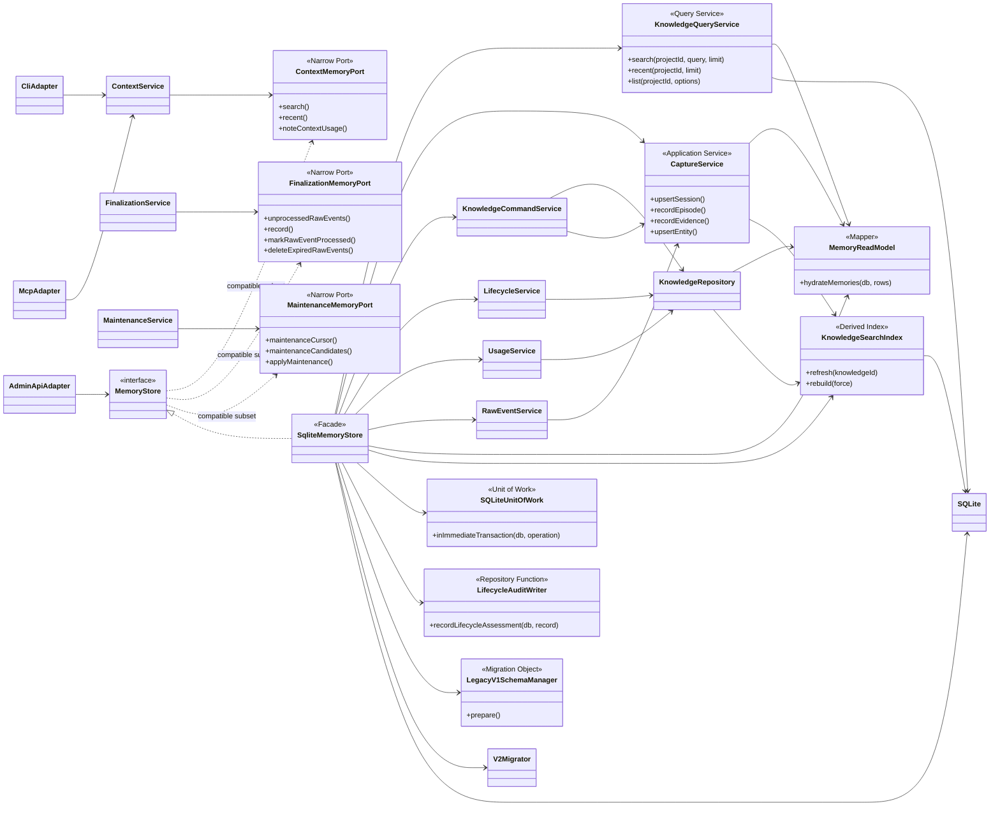
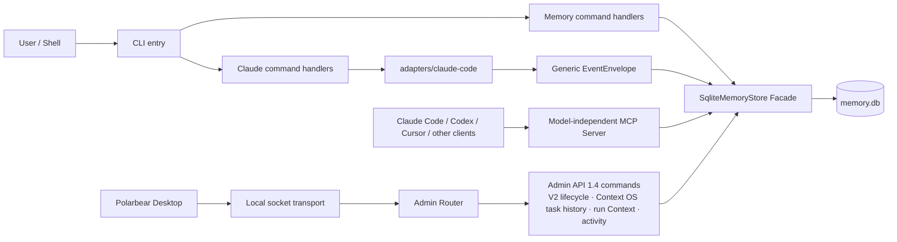
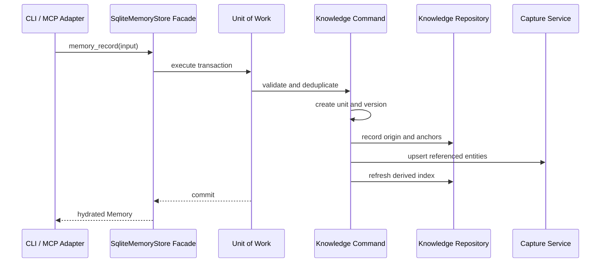
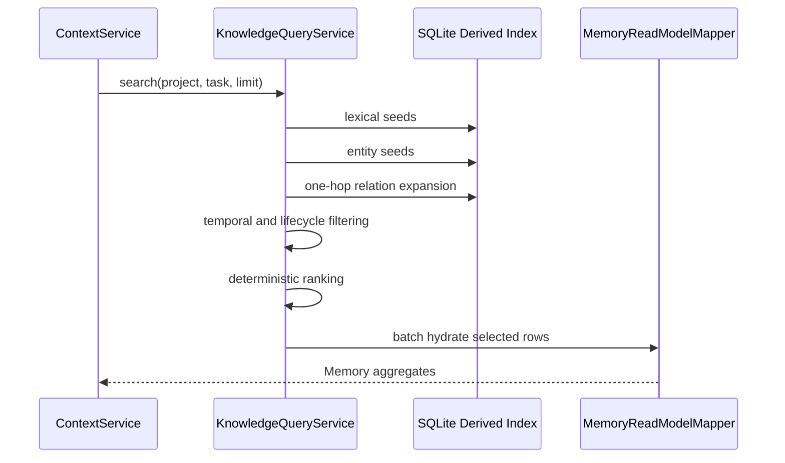
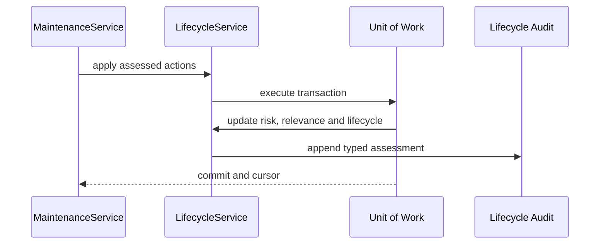

# Polarbear Memory — TRD 补充：代码架构与 UML 设计

> 状态：V2 / v0.1 GA 后的结构治理基线  
> 约束：所有图均为仓库内 Mermaid 文本，不调用任何远程渲染服务。  
> 配套规范：[`../AGENTS.md`](../AGENTS.md)

## 1. 目的

本文补充 `TRD.md` 中的数据与部署设计，定义代码职责、依赖方向、事务边界和结构演进路线。设计目标不是把 Spring Framework 搬进本地 CLI，而是采用其成熟的分层思想：Adapter、Application Service、Facade、Repository、Mapper 与 Unit of Work 各自只有一个变化原因。

## 2. 设计审查结论

审查前的主要缺陷：

| 级别 | 问题 | 风险 | 本轮处理 |
|---|---|---|---|
| P1 | `sqlite-store.ts` 2090 行，混合迁移、事务、检索、索引、映射、审计和 CRUD | 任一能力演进都可能影响整个 Store | 已拆出 Query、Command、Lifecycle、Usage、Capture、Raw Event、Repository、Mapper、Index、Migration 与 Unit of Work；Facade 降至 376 行 |
| P1 | 12 处手写事务模板 | 漏 rollback、异常被覆盖、实现漂移 | 运行时统一为 `inImmediateTransaction`；迁移保留独立恢复事务 |
| P1 | 5 处生命周期审计 SQL | 字段顺序、policy/assessor 版本可能不一致 | 统一为 typed `recordLifecycleAssessment` |
| P1 | 聚合 hydration 与查询编排耦合 | N+1 或新增字段漏映射 | 独立 `memory-read-model.ts`，批量装配关系、证据、实体、锚点和统计 |
| P2 | 混合检索算法直接嵌入 Store | 无法单测或独立演进排序算法 | 独立 `KnowledgeQueryService` |
| P2 | FTS 刷新、重建混入 canonical CRUD | 派生数据边界不清 | 独立 `KnowledgeSearchIndex`，可全量重建 |
| P2 | V1 DDL 和兼容迁移混入正常运行类 | 容易继续依赖旧表 | 独立 `LegacyV1SchemaManager` |
| P2 | 兼容 Facade 曾包含多个命令能力域 | 类偏大，新增功能可能回流 | 已完成 Command/Lifecycle/Usage/Raw Event 拆分并设置 400 行硬限制 |

## 3. 最终核心 UML（As-built）

以下是 R1–R4 完成后的真实依赖。`MemoryStore` 是向后兼容的组合契约；Application Service 只依赖各自所需的最小 Port。TypeScript 的 `Pick` 是结构类型关系，因此图中使用“compatible subset”，不把它误画成运行时继承。

## 4. 最终入口与 Adapter UML（As-built）

所有 Agent 共用标准 MCP Server。厂商 Adapter 只处理厂商专属的安装配置与生命周期事件；Desktop 通过本地 Admin API 管理 Engine，不直接读写 `memory.db`。

### 4.1 模式与变化轴

| 模式 | 解决的变化 |
|---|---|
| Hexagonal Port / Adapter | CLI、MCP、Desktop API 改变时不污染领域与存储 |
| Facade | 保持现有 `MemoryStore` 契约，内部可持续演进 |
| Application Service | 不同用例的事务与业务编排独立变化 |
| Repository | Schema/SQL 改变不向上泄漏 |
| Mapper / Read Model | V2 多表聚合与公开兼容模型独立演进 |
| Query Service | lexical、entity、graph、temporal 排序集中实现并可独立评测；出现第二套算法后再提取 Strategy，避免提前抽象 |
| Unit of Work | 事务策略与业务步骤解耦 |
| Audit Repository | 淘汰/验证策略的审计结构始终一致 |
| Derived Index | FTS 可丢弃重建，不成为 canonical 真相来源 |
| Migration Object | 一次性旧库兼容不污染正常运行路径 |

## 5. 关键时序

### 5.1 写入知识

### 5.2 读取上下文

### 5.3 生命周期淘汰

## 6. 数据依赖规则

1. Runtime 只能读写 V2 canonical 表和 derived 表；`legacy_*_v1` 只供迁移核验。
2. Query Service 可读 canonical 与 derived 数据，不执行写操作。
3. Search Index 可写 derived 表，不改变 canonical knowledge。
4. Mapper 只读并返回领域模型，不执行业务决策。
5. Service 开启事务，Repository 参与已有事务，不开启嵌套事务。
6. Facade 不返回 SQLite row、statement 或 database handle。

## 6.1 Agent 与 MCP 边界

`protocol-mcp` 是模型和 Agent 无关的标准入口。Claude Code、Codex、Cursor 或其他 MCP client 共享同一套工具合约、project binding 与权限边界，不为每个 Agent 复制 MCP server。

`adapters/<agent>` 只容纳厂商专属能力：配置文件安装、规则文件以及 lifecycle hook/event 转换。当前 `adapters/claude-code` 把 Claude 的 `Stop` / `SessionEnd` 转成通用 `AGENT_STOP` / `AGENT_SESSION_END` envelope；Core 同时读取旧 `CLAUDE_*` event 以兼容已有数据库和 spool。关闭 Claude adapter 后，CLI、通用 MCP、Admin API 和 Desktop 仍完整可用，只有 Claude 自动 handoff 与一键配置消失。

只有当 Codex 提供需要专门适配的配置或 lifecycle event 时才建立 `adapters/codex`；仅通过 MCP 使用 Memory 不需要 Codex adapter。

## 7. 安全设计

- SQLite `allowExtension=false`、`trusted_schema=OFF`，不加载远程或本地扩展。
- UML 使用 Mermaid 源码随文档保存，不请求 PlantUML remote server。
- 所有外部文本使用绑定参数；动态 SQL 只允许受限枚举或已限长的占位符。
- Desktop 通过 Engine API 管理 memory，不直接打开数据库，因此 schema 升级、事务和审计不会被第二写入者绕过。
- Migration 先备份；失败恢复原库并保留失败现场；派生索引可离线重建。

## 8. 结构演进 Roadmap

完整治理路线固定为 R1–R4。开始集中重构时 R1 已完成，因此当时所说的“剩余三个阶段”特指 R2、R3、R4，并不是还存在一个未执行的第五阶段。当前四个阶段均已完成，每一阶段结束时仓库都保持可构建、可测试、可运行。

### R1 — 基础治理（已完成，可运行）

- Unit of Work、Lifecycle Audit Writer、Read Model Mapper。
- Hybrid Query Service、Derived Search Index。
- Legacy V1 Migration Object。
- 保持全部 CLI / MCP / Desktop API 与 V2 schema 兼容。

验证：`npm run typecheck && npm test && npm run benchmark:ga && npm run package:check`。

### R2 — Command 拆分（已完成，可运行）

- Session / Episode / Evidence / Entity 已移至 `CaptureService`。
- record / update / purge / relation 已移至 `KnowledgeCommandService`。
- 共享 Knowledge 聚合读取、版本、来源、锚点已移至 `KnowledgeRepository`。
- `SqliteMemoryStore` 已降至 376 行，只保留兼容 Facade、数据库启动、Service 装配和管理操作。

验证：现有 API contract tests 全绿；V2 aggregate tests 覆盖项目隔离和写入原子性。

### R3 — Lifecycle 与 Usage 拆分（已完成，可运行）

- verify / archive / restore / complete / maintenance 已移至 `LifecycleService`。
- context usage / feedback / token savings 已移至 `UsageService`。
- Agent lifecycle ingestion 已移至 `RawEventService`。
- lexical / entity / graph / temporal 的确定性排序已集中到 `KnowledgeQueryService` 并独立测试。当前只有一套生产算法，暂不引入无第二实现的 `RetrievalStrategy` 接口。

验证：四层淘汰验证方案、token savings reset、deterministic retrieval 全绿。

### R4 — Port 精简与入口拆分（已完成，兼容发布）

- Application Service 已依赖最小 `ContextMemoryPort`、`FinalizationMemoryPort`、`MaintenanceMemoryPort`；兼容 Facade 继续实现组合接口。
- CLI 已拆为入口、Memory command handlers、Claude command handlers。
- Local Admin API 已拆为 socket transport 与 Admin Router。
- 作为内部重构发布，不改变用户命令与 MCP 工具。

验证：递归测试发现覆盖 CLI、MCP、Local Admin API 与 Agent adapter；npm 发布白名单、离线约束、GA benchmark、依赖审计和 license gate 全绿。

## 9. 完成定义

- 实际依赖与 UML 一致，禁止从 Domain 指向 Storage/Protocol。
- 新生产类不超过 400 行；兼容 Facade 按 Roadmap 持续下降且不得超过冻结线。
- 运行时事务模板和生命周期 INSERT 各只有一个实现。
- FTS 删除后可以完全 rebuild；迁移失败可恢复。
- README、用户手册、TRD、本文和真实 CLI/MCP 行为一致。
# Context OS UML addendum

The current schema v8 design, provider-neutral runtime architecture, Context Packet planner, lifecycle sequence, migration boundary, and implementation roadmap are defined in [CONTEXT_OS_DESIGN.md](./CONTEXT_OS_DESIGN.md). That document is the normative UML supplement for the Agent Context OS upgrade. The existing diagrams below remain the Option B Memory-plane baseline.
