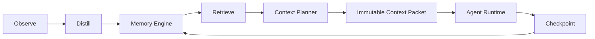

# Agent Context OS

[简体中文](../../zh-CN/architecture/context-os.md)

## Decision

Durable task state belongs to Polarbear. Codex and Claude Code sessions are bounded, replaceable execution environments.

The Context OS extends the Memory Engine; it does not replace the Option B storage model.

## Domain model

- **Task:** durable objective, status, phase, priority, and latest checkpoint.
- **Checkpoint:** structured snapshot and delta of changed work, findings, decisions, constraints, failures, verification, unresolved items, and remaining work.
- **Context Packet:** immutable, versioned, token-bounded projection with source provenance.
- **Agent Session:** opaque provider-session mapping; external identifiers are stored as hashes.
- **Execution Run:** one managed or assisted execution attempt associated with task, packet, session, provider, and outcome.
- **Observation:** validated and redacted provider-neutral activity event.
- **Usage Ledger / Retrieval Run:** logical context and provider-usage evidence.

The domain contract is owned by `src/domain/context-os.ts`.

## Context planning

The planner combines task state, latest checkpoint, hybrid Memory search, and recent scoped Memory. It reserves mandatory P0 slots for the first available:

- objective;
- working state;
- hard constraint;
- accepted decision;
- high-risk or disputed verification item.

Optional architecture, episodic, verification, and semantic candidates are admitted only within their category and total budgets. Large items are truncated but retain source IDs for progressive disclosure. The final rendered packet is never allowed to exceed its configured hard budget.

Every packet records its hash, sources, selection reasons, category usage, exclusions, estimated tokens, and retrieval latency. Raw current requests are returned to the caller but only a digest is persisted. Packet construction, delivery, and delivery failure are accounted separately. A Context receipt reports the task, checkpoint, selected source counts, integration mode, delivery point, and latest delivery outcome; constructing a packet alone is not evidence that an Agent received it.

When no explicit hard budget is supplied, the planner chooses an automatic budget between 500 and 8,000 tokens from request size, task/checkpoint presence, mandatory items, and the bounded retrieved candidate set. A workspace in `custom` mode always supplies its configured hard budget instead. Automatic budgeting is deterministic and never bypasses the 12,000-token absolute safety limit.

## Lifecycle integration

The provider-neutral `LifecycleOrchestrator` maps lifecycle events onto existing Context OS ports. Claude Code lifecycle-managed mode supports SessionStart, UserPromptSubmit, PreToolUse, PostToolUse, PostToolUseFailure, PostToolBatch, PreCompact, PostCompact, Stop, StopFailure, and SessionEnd hooks.

- hook payloads are bounded and redacted;
- raw prompts are represented by digests;
- SessionStart resolves an explicit or deterministic active Task and returns bounded continuation context;
- UserPromptSubmit uses the raw prompt transiently for retrieval and returns prompt-specific additional context before model processing;
- Stop and StopFailure run session-scoped deterministic distillation, so SessionEnd is only a bounded final flush;
- PreCompact preserves the previous structured continuation state instead of replacing it with a generic marker;
- PostCompact records the boundary; the next prompt performs rehydration because PostCompact does not support context injection;
- duplicate event fingerprints are idempotent;
- database failures spool events locally for later replay.

The baseline distiller extracts only explicitly labeled reusable decisions, pitfalls, task state, and next steps. It does not claim general semantic understanding of arbitrary tool output.

Stock Codex project integration remains MCP-assisted because it does not expose an equivalent project hook surface to Polarbear. The optional Polarbear Codex App Server gateway is a separate, explicitly installed managed path. It proxies the official bidirectional JSONL protocol, injects Context before `turn/start` and `turn/steer`, consumes thread/turn/item and compaction notifications, and forwards approvals and provider responses unchanged. Only clients launched through that descriptor are lifecycle-managed; ordinary Codex CLI/Desktop sessions remain MCP-assisted.

Lifecycle telemetry is stored as bounded aggregate counters rather than an unbounded event log. It reports provider/event distribution, accepted and fail-open outcomes, spool replay, retrieval and hook latency, injected token estimates, observation processing, checkpoint reasons, and automatically persisted hook Memory.

## Managed runtimes and rotation

`AgentRuntime` is provider-neutral. Codex and Claude Code adapters implement detection, start, resume, JSONL event parsing, usage extraction, and provider permission arguments.

Managed sessions are disabled unless `POLARBEAR_MANAGED_SESSIONS=1`.

- Codex defaults to its `read-only` sandbox; writable mode selects `workspace-write`.
- Claude Code defaults to `--permission-mode plan`; writable mode selects `acceptEdits`.
- A model override is passed to the provider and stored with the run.

Rotation is deterministic. Signals include task or phase changes, context budget, pollution, compaction, run/turn limits, provider failure, and manual requests. A rotation without an existing durable checkpoint is rejected. When allowed, Polarbear persists a new rotation-boundary checkpoint before launching a fresh session.

Resume failure records the failed run and falls back to a fresh session using the same durable task and packet.

## Persistence

Schema v10 includes tasks, agent sessions, execution runs, observations, checkpoints, retrieval runs, context packets/items, Context delivery receipts, usage ledger records, and bounded lifecycle counters. The migration is additive, backed up, transactional, and foreign-key checked.

## Desktop UX contract

Polarbear Desktop is a focused Context client, not a Memory database administration surface. Its primary workflows are viewing assembled Context, searching durable Memory, and resolving rare exceptions. The full project path is visible in the Context header.

- Context usage is shown as assembled tokens over the active budget. Budget mode is either `auto` or `custom`; `auto` is the default.
- The Context landing page reads the latest immutable packet through `contexts.current`, summarizes its source categories, and shows only Current Context, Memory reuse, token impact, and exception health.
- Savings are shown as a positive `Token savings` percentage. When assembled Context is larger than the comparison baseline, Desktop shows `Token impact` and a positive `more` percentage instead of a negative reduction.
- Normal active Memory does not require approval. Attention is reserved for conflicts, disputed Memory, and important low-confidence or stale Memory.
- Confirming an exception persists verification. Rejecting it removes the Memory from retrieval while retaining its revision history.
- A human edit creates a revision and immediately becomes high-confidence, human-verified Memory. Confirm raises confidence and clears attention. Reject performs an explicit `REJECTED` lifecycle transition; it is not disguised as archive or deletion.
- Engine and MCP lifecycle is automatic. Desktop reports Codex and Claude Code integration health through the Admin API and offers a bounded repair action; it does not expose start/stop process controls.
- Desktop never reads project configuration, Agent configuration, or `memory.db` directly. Budget settings, integration health, and repair all cross the versioned Admin API.
- Desktop navigation is limited to Context, Memory, and Settings. Raw-history retention is visible as a summary and editable only under Advanced; durable Memory has no age-based TTL.

## Verification evidence

Automated coverage includes:

- task/checkpoint persistence and idempotency;
- mandatory P0 budget behavior and packet traceability;
- Context OS A/B/C evaluation fixtures;
- Claude SessionStart and PreCompact lifecycle behavior;
- Codex and Claude CLI JSONL/permission contracts;
- checkpoint-before-rotation and resume recovery;
- Codex-to-Claude and Claude-to-Codex handoff.

Real provider billing measurements, sustained dogfood, and release-time CLI compatibility remain external release evidence rather than code-level claims.
