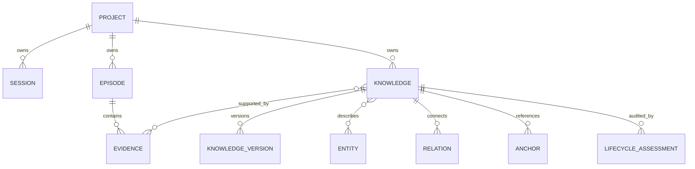

# Memory Engine

[简体中文](../../zh-CN/architecture/memory-engine.md)

## Purpose

The Memory Engine preserves reusable engineering knowledge independently of any one agent session. It implements the approved Option B model: lossless evidence and episodes support versioned knowledge, entities, relations, and bounded retrieval.

## Canonical model



The canonical SQL definition and migration checksum are owned by `src/storage/schema-v2.ts`. Narrative documents do not reproduce the complete DDL.

## Public Memory abstraction

The public Memory API projects a Knowledge aggregate with:

- type and content;
- source and evidence;
- confidence, importance, relevance, and correctness risk;
- lifecycle and verification state;
- file anchors, entities, and relations;
- revision history and usage metadata.

The current type set includes facts, decisions, constraints, architecture, conventions, pitfalls, workarounds, task state, and TODOs. The domain source remains `src/domain/memory.ts`.

## Runtime launch descriptor

`polarbear-memory install` ensures a schema-versioned descriptor exists at `<Polarbear data root>/runtime/launch.json`. It records the absolute `process.execPath` and package-owned `dist/cli.js` path that performed installation. Descriptor repair is independent of project initialization and Agent configuration changes: a missing descriptor is created, a stale descriptor is replaced, and a current descriptor is left untouched.

The canonical path, schema version, and runtime fields are defined by `api/runtime-launch-v1.json`; Desktop consumes a vendored copy of that contract. Desktop validates both paths and starts the Engine with structured arguments equivalent to `runtime executable`, `CLI entrypoint`, `service`, `run`; it does not parse Codex configuration or invoke a shell. An explicit Desktop override remains higher priority for recovery.

## Write and retrieval flow

```text
validated input
  → canonical Knowledge + Version + Evidence transaction
  → entity/relation/anchor links
  → derived search document refresh

query
  → lexical + entity + relation + temporal candidates
  → lifecycle/correctness filters
  → deterministic ranking
  → hydrated Memory aggregates
```

Writes use `BEGIN IMMEDIATE` through the shared transaction helper. SQL parameters are bound. Aggregate hydration is centralized to avoid protocol-specific row shapes and N+1 reads.

## Lifecycle and retention

Knowledge retirement is a four-layer policy:

1. **Correctness:** disputed or source-invalid knowledge receives risk and warning treatment.
2. **Supersession:** a newer identity explicitly supersedes an older identity through a relation; historical evidence is preserved.
3. **Utility:** completed short-term task state can leave the active set after its retention period.
4. **Storage retention:** canonical durable knowledge is not silently purged merely because it is old or rarely used.

Every automatic lifecycle action is bounded, explainable, audited, and reversible unless the user explicitly requests physical purge.

The former standalone “knowledge retirement validation plan” is no longer an active specification. Its accepted behavior is owned here, while executable evidence is owned by:

- `src/application/retention-validation.test.ts`;
- `src/application/maintenance.test.ts`;
- `fixtures/retention-180d/fixture.json`;
- `npm run benchmark:ga`.

## Migration and recovery

- File databases receive a preflight backup before schema migration.
- Additive migrations execute transactionally and run foreign-key validation.
- Failure restores the preflight backup and retains the failed candidate for diagnosis.
- A database created by a newer Engine is rejected for writing.
- Derived indexes can be rebuilt from canonical state.

## Ownership map

| Concern | Owner |
|---|---|
| Schema and migrations | `src/storage/schema-v2.ts`, `migrate-v2.ts`, `legacy-v1-schema.ts` |
| Knowledge writes | `knowledge-command-service.ts`, `knowledge-repository.ts` |
| Aggregate reads | `memory-read-model.ts` |
| Retrieval | `knowledge-query-service.ts`, `knowledge-index.ts` |
| Lifecycle | `lifecycle-service.ts`, `maintenance.ts`, `lifecycle-assessments.ts` |
| Evidence capture | `capture-service.ts`, `raw-event-service.ts` |
| Compatibility facade | `sqlite-store.ts` |
