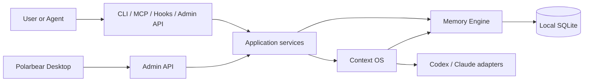

# Architecture overview

[简体中文](../../zh-CN/architecture/overview.md)

## System boundary

Polarbear has two cooperating planes:

- the **Memory Engine**, which owns evidence, durable knowledge, relations, lifecycle, and retrieval;
- the **Agent Context OS**, which owns tasks, checkpoints, context assembly, execution runs, observations, provider sessions, and rotation.

SQLite is the canonical local store. MCP, CLI, Claude hooks, and the local Admin API are adapters. Polarbear Desktop is a client of the versioned Admin API and never accesses the database directly.



## Dependency direction

```text
protocols and adapters
        ↓
application services and ports
        ↓
domain model

storage implements application/domain ports
runtime adapters implement AgentRuntime
```

The domain layer does not depend on SQLite, MCP, HTTP, CLI, Codex, or Claude Code.

## Durable and derived state

Canonical state includes project identity, evidence, knowledge, versions, relations, tasks, checkpoints, sessions, runs, observations, and usage records.

FTS documents and search indexes are derived. They can be rebuilt and must not become a prerequisite for recovering canonical data.

## Trust boundaries

- Context Packet content is labeled untrusted historical data.
- External event payloads are validated, bounded, and redacted before persistence.
- Raw prompts, secrets, tokens, cookies, and complete environment variables are not durable Memory.
- Provider CLIs are separate processes launched with argument arrays and `shell: false`.
- The Engine performs no implicit telemetry, remote rendering, or default network access.

## Detailed designs

- [Memory Engine](./memory-engine.md)
- [Agent Context OS](./context-os.md)
- [MCP protocol](../protocols/mcp.md)
- [Admin API](../protocols/admin-api.md)
- [Repository map](../implementation/repository-map.md)
