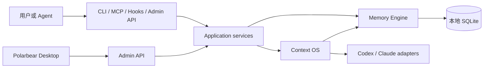

# 总体架构

[English](../../en/architecture/overview.md)

## 系统边界

Polarbear 由两个协作平面组成：

- **Memory Engine**：管理证据、长期知识、关系、生命周期和检索；
- **Agent Context OS**：管理任务、checkpoint、上下文组装、执行记录、observation、provider session 和 rotation。

SQLite 是本地 canonical store。MCP、CLI、Claude hooks 和本地 Admin API 都是 adapter。Polarbear Desktop 只能调用带版本的 Admin API，不能直接访问数据库。



## 依赖方向

```text
protocol 与 adapter
        ↓
application service 与 port
        ↓
domain model

storage 实现 port
runtime adapter 实现 AgentRuntime
```

Domain 不依赖 SQLite、MCP、HTTP、CLI、Codex 或 Claude Code。

## Canonical 与 derived 数据

Project、Evidence、Knowledge、Version、Relation、Task、Checkpoint、Session、Run、Observation 和 Usage 属于 canonical state。

FTS 文档与搜索索引属于 derived state，必须能够从 canonical 数据重建。

## 信任边界

- Context Packet 明确标记为不可信历史数据。
- 外部事件必须先校验、限长、脱敏，再持久化。
- 原始 prompt、secret、token、cookie 和完整环境变量不进入长期 Memory。
- Provider CLI 使用参数数组和 `shell: false` 启动。
- Engine 不进行隐式遥测、远程渲染或默认联网。

## 详细设计

- [Memory Engine](./memory-engine.md)
- [Agent Context OS](./context-os.md)
- [MCP 协议](../protocols/mcp.md)
- [Admin API](../protocols/admin-api.md)
- [实现映射](../implementation/repository-map.md)
